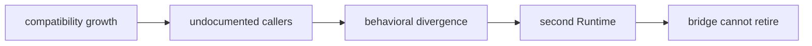

# Risk register

The compatibility package’s central risk is permanent divergence disguised as
helpful backward compatibility. The register below names observable signals and
the evidence required to reduce each risk.

| Risk | Early signal | Consequence | Required control |
| --- | --- | --- | --- |
| second Runtime | new lifecycle, provider, tool, state, or transport logic lands locally | two canonical behaviors emerge | move policy to Runtime and retain only forwarding |
| undocumented caller dependence | nested import or error behavior appears in applications but not the contract | removal breaks consumers that tests do not represent | caller inventory and path-specific contract test |
| parity drift | identity, state, error, warning, ordering, or artifact differs | migration changes behavior | direct legacy-to-Runtime comparison including a negative path |
| optional-dependency leak | base import loads provider dependencies or credentials | minimal installs fail or behave differently | provider isolation and unavailable-extra tests |
| durable-state coupling | old snapshots require bridge code to reopen | bridge becomes permanent storage infrastructure | Runtime-owned schema and decoder proof |
| circular dependency | canonical package imports the legacy namespace | ownership cannot be unwound | import-boundary guard and dependency correction |
| retirement without evidence | deprecation is date-driven or based only on repository search | external callers lose supported access | canonical replacement, caller evidence, release communication |
| compatibility growth | additions outpace retired surfaces | bridge burden increases despite migration intent | retirement budget and review of every added export |

## Release posture

A package-local green suite does not close caller or retirement risk. Release
review needs the surface inventory, canonical destination, parity evidence,
remaining caller evidence, and an explicit removal condition. Unknown callers
keep the affected surface supported; they do not justify new behavior.

## Escalation

Treat canonical reverse imports, bridge-owned policy, incompatible durable
state, and silent failure translation as release-blocking. Track broader
historical surface and incomplete caller inventory as active risks with named
evidence, not as generic technical debt.
