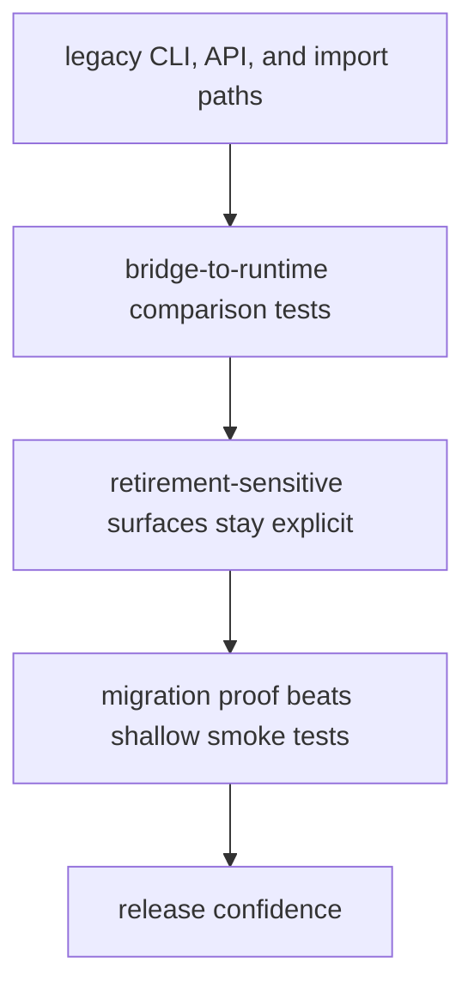

# Test Strategy

A useful test strategy names what evidence is needed and why shallow coverage is not enough.

For `agentic-proteins`, the test story should compare legacy bridge behavior with canonical runtime behavior and keep retirement-sensitive surfaces under explicit proof.

## Strategy Model

This page should help readers see that bridge testing is not generic coverage work. The value is in proving equivalence and making sure legacy paths can still be retired intentionally.

## Review Rules

- favor compatibility tests that compare the bridge path to the canonical runtime result
- cover retirement-sensitive CLI, API, and import surfaces explicitly
- do not let shallow smoke tests substitute for migration proof

## First Proof Check

- `packages/agentic-proteins/tests`
- `src/agentic_proteins/interfaces/cli.py` and `api/app.py`
- `src/agentic_proteins/runtime/`

## Design Pressure

The easy mistake is to accept passing smoke tests while skipping the direct comparison that proves the bridge still agrees with runtime.
