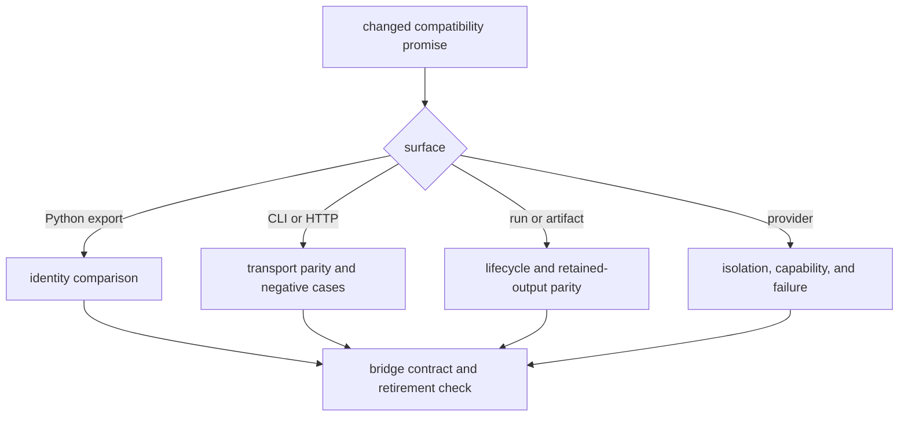

# Test strategy

Compatibility testing compares a declared legacy promise with its canonical
Runtime owner. Coverage inside the bridge is secondary to proof that callers
observe the same identity or behavior and that retirement remains possible.

## Evidence layers

| Layer | Question answered | Representative tests |
| --- | --- | --- |
| import identity | do promised top-level objects resolve to the Runtime objects? | `test_runtime_forwarding_import_contract.py`, `test_import_forwarding.py` |
| bridge contract | which surfaces remain, who owns them, and what closes retirement? | `test_bridge_contracts.py`, package import guards |
| CLI and HTTP | do requests, responses, exits, errors, and refusal states agree? | `tests/interfaces/`, `tests/integration/test_cli.py` |
| run lifecycle | do state transitions, cancellation, resume, and terminal outcomes agree? | orchestration run and state-machine tests |
| artifact contract | are provenance, identifiers, warnings, and outputs retained? | `test_artifact_first.py`, artifact helper tests |
| provider isolation | do optional providers remain isolated and fail explicitly? | `tests/providers/` and local-model tests |
| operational stress | does compatibility survive provider loss, batch pressure, and observability paths? | `tests/e2e/` |

## Select proof from the promise



Run the narrow comparison first. Then run the complete package suite when a
public surface, shared fixture, bridge contract, or dependency changes:

```bash
uv run --project packages/agentic-proteins \
  pytest -q packages/agentic-proteins/tests
```

When parity depends on a Runtime change, run the matching Runtime tests from
the same revision. A bridge-only green suite cannot prove equivalence to an
untested owner.

## Evidence that does not close parity

A smoke test showing that an entry point starts does not prove output parity.
A top-level identity test does not cover nested historical modules. A snapshot
of similar JSON does not prove error, ordering, warning, or lifecycle parity.
An end-to-end scenario does not replace the focused comparison that identifies
which contract regressed.
