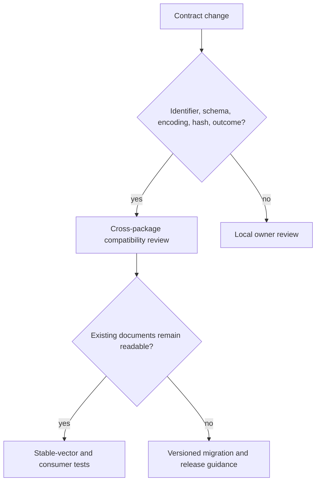

# Architecture Risks

Foundation failures propagate widely because every higher package consumes its identifiers, models, serialization, hashes, or outcomes. A small convenience change can become a repository-wide contract break.

| Risk | Consequence | Control |
| --- | --- | --- |
| Identifier collapse | Programs, claims, evidence, assays, and artifacts become interchangeable strings | Preserve distinct validated identifier types |
| Non-canonical encoding | Equal logical values produce different bytes or hashes | Normalize supported values and test canonical JSON determinism |
| Hash semantic drift | Existing digests change after an implementation update | Version the contract and verify stable vectors across releases |
| Permissive model evolution | Unknown or misspelled fields are silently accepted | Keep strict models and explicit schema assessment |
| Migration guesswork | Unsupported documents are partially coerced | Require a known source, target, and declared migration path |
| Policy leakage | Shared results or states encode one package’s scientific decision | Keep foundation outcomes neutral and downstream policy local |
| Root API growth | Specialized concepts become de facto universal contracts | Enforce the curated export budget and owner-module boundaries |
| Time-dependent identity | Timestamps or process state alter content fingerprints | Separate audit metadata from contract-relevant canonical content |

The highest-risk change is one that appears backward compatible in Python but changes serialized meaning. Compatibility must be evaluated against persisted documents and downstream consumers, not import success alone.

## Match proof to the contract change

| Changed surface | Minimum review evidence |
| --- | --- |
| identifier validation or normalization | accepted and rejected stable vectors, collision analysis, and every consumer that persists the identifier |
| canonical serialization | byte-for-byte fixtures across key order, supported value types, processes, and supported releases |
| hash or fingerprint policy | old and proposed digests, field-boundary declaration, collision assumptions, and migration or coexistence plan |
| strict model or document schema | compatibility assessment, unknown-field behavior, persisted fixtures, migration validation, and round-trip evidence |
| error, refusal, or disposition contract | producer and consumer handling over success, failure, degraded, and unsupported paths |
| public root export | ownership decision, dependency impact, import-cost check, and evidence that the concept is genuinely shared |

Passing the new implementation's unit tests is insufficient when old bytes or
downstream readers are affected. The review closes only when persisted records
and declared consumers have an explicit readable, migratable, or incompatible
disposition.
