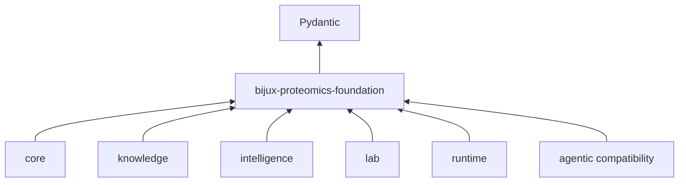

# Dependency Direction

Foundation is intentionally at the bottom of the Python dependency graph. Its required runtime dependency is Pydantic; the proteomics packages depend on foundation, never the reverse.

## Import rules

- `identity`, `serialization`, `compatibility`, `outcomes`, and `support` may depend on Python or Pydantic primitives and on lower-level foundation modules.
- Compatibility code may transform document shape, but it must not import a domain package to interpret scientific meaning.
- Testing helpers may inspect downstream source trees supplied by callers; production modules must not depend on the testing family.
- Optional scientific libraries are test dependencies only. They do not become an implicit runtime requirement of canonical serialization.
- Package aliases preserve approved import compatibility. They are routing metadata, not a second implementation surface.

## Why the direction matters

An identifier or canonical document is valuable only if every consumer agrees on it. Pulling core, knowledge, intelligence, lab, or runtime semantics into foundation would create cycles and make a supposedly shared contract depend on one consumer's policy. Keeping the package narrow also allows tools to validate or migrate documents without installing an execution stack.

## Cross-boundary changes

A change to a shared identifier, serialized field, digest rule, schema version, or failure shape is a repository-wide contract change. Review it against three questions:

1. Does the old document remain readable, or is there an explicit migration path?
2. Does canonical serialization remain deterministic across processes and supported Python versions?
3. Can downstream packages consume the change without foundation importing them?

If scientific interpretation is required to answer the third question, the behavior belongs in the downstream owner and foundation should carry only the neutral data contract.
