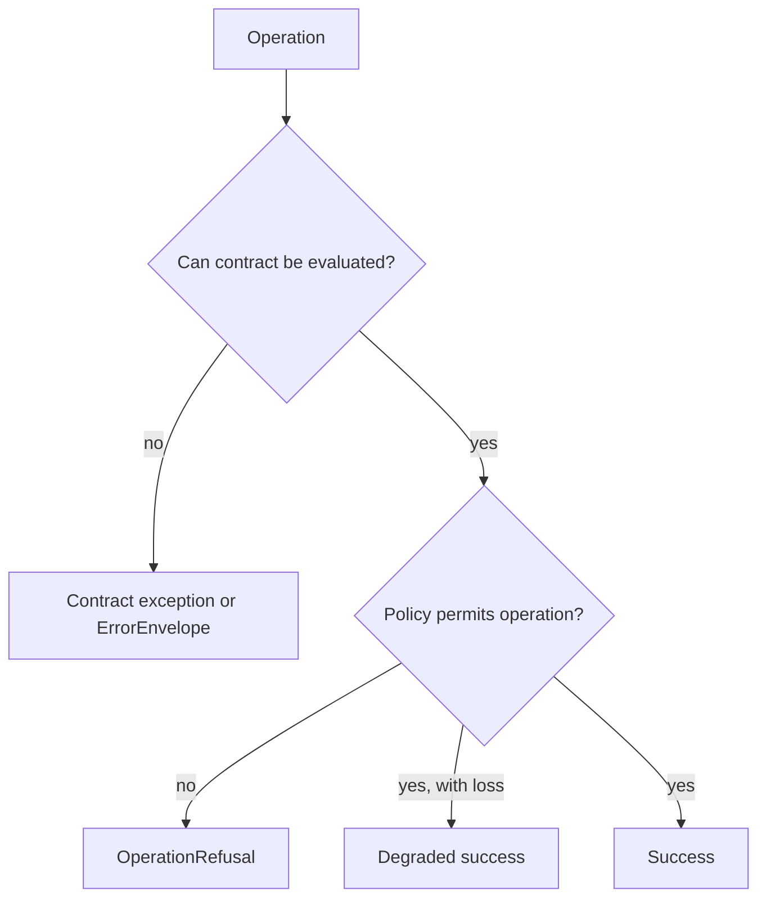

# Error Model

Foundation distinguishes exceptions, structured errors, refusals, and degraded success. Consumers can then decide whether to correct input, restore data, install a capability, choose another path, or stop under policy.

## Structured outcomes

| Surface | Values | Use |
| --- | --- | --- |
| `ErrorCategory` | validation, I/O, runtime, dependency, data integrity | Classify operational failure without importing downstream policy |
| `ErrorEnvelope` | category, message, code, details, retryability, exception chain | Carry a machine-readable failure across package or process boundaries |
| `RefusalKind` | unsupported, unsafe, lossy, ambiguous | Explain an intentional decision not to perform an operation |
| `OperationDisposition` | success, refused, degraded success | Represent an operation whose result is more nuanced than exception or value |
| `SupportState` | advisory, supported, refused, ambiguous, incomplete, lossy | Describe evidence or capability posture without claiming scientific truth |

Python exceptions cover contract mechanics: `ContractValidationError`, `ContractNotFoundError`, `ContractConflictError`, `MigrationPathError`, `MigrationExecutionError`, and `MissingOptionalDependencyError` share `FoundationContractError`.

Validation failure is not refusal: invalid input never satisfied the contract, while refusal means valid input was deliberately not processed. Missing optional dependencies are not generic runtime failures, and data-integrity failures must not be marked retryable without evidence that retry can repair them.
