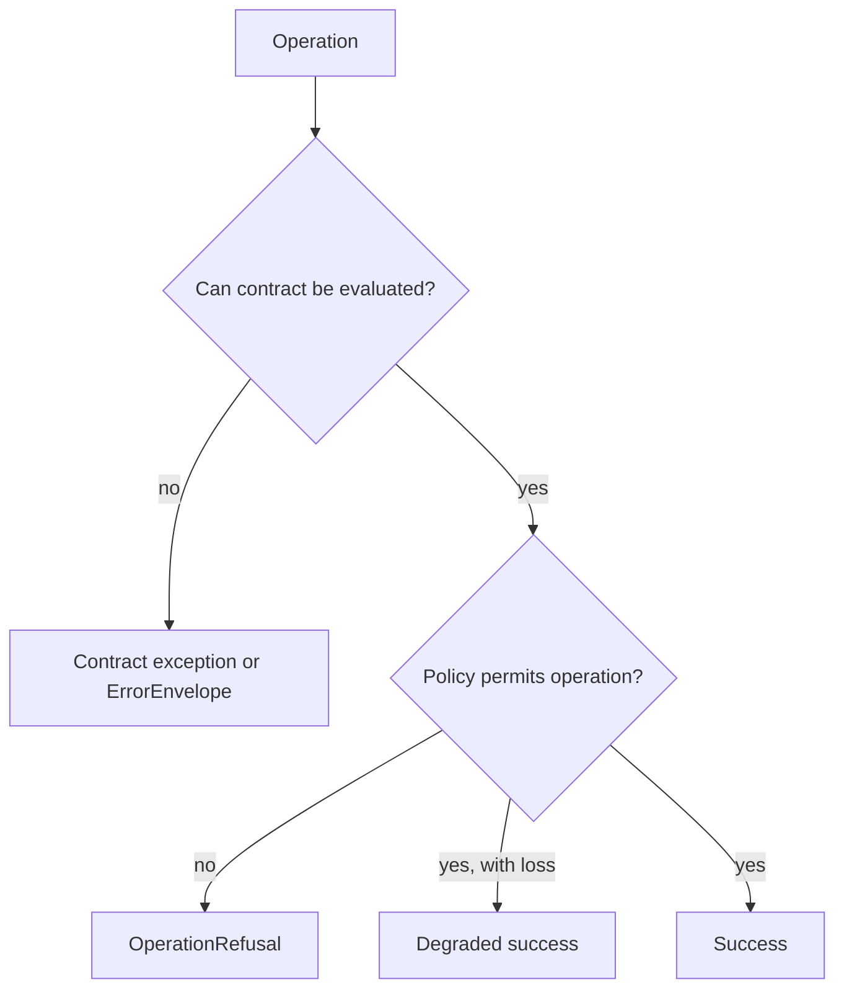

# Error Model

Foundation distinguishes exceptions, structured errors, refusals, and degraded success. Consumers can then decide whether to correct input, restore data, install a capability, choose another path, or stop under policy.

## Structured outcomes

| Surface | Values | Use |
| --- | --- | --- |
| `ErrorCategory` | validation, I/O, runtime, dependency, data integrity | Classify operational failure without importing downstream policy |
| `ErrorEnvelope` | category, message, code, details, retryability, exception chain | Carry a machine-readable failure across package or process boundaries |
| `RefusalKind` | unsupported, unsafe, lossy, ambiguous | Explain an intentional decision not to perform an operation |
| `OperationDisposition` | success, refused, degraded success | Represent an operation whose result is more nuanced than exception or value |
| `SupportState` | advisory, supported, refused, ambiguous, incomplete, lossy | Describe evidence or capability posture without claiming scientific truth |

Python exceptions cover contract mechanics: `ContractValidationError`, `ContractNotFoundError`, `ContractConflictError`, `MigrationPathError`, `MigrationExecutionError`, and `MissingOptionalDependencyError` share `FoundationContractError`.

Validation failure is not refusal: invalid input never satisfied the contract, while refusal means valid input was deliberately not processed. Missing optional dependencies are not generic runtime failures, and data-integrity failures must not be marked retryable without evidence that retry can repair them.

## Choose the consumer response

| Observed outcome | Consumer action | Evidence to preserve |
| --- | --- | --- |
| validation or schema failure | correct the payload or select the declared schema; do not retry unchanged input | field path, stable code, expected contract, received value class, and source identity |
| contract not found | restore the named contract or stop using that identifier | requested contract identity, lookup boundary, and available alternatives |
| contract conflict | require an owner decision; do not choose a winner by load order | conflicting identities, versions, producers, and registration sources |
| migration path absent | retain the source document and refuse conversion | source and target schemas, compatibility assessment, and missing path |
| migration execution failure | preserve source plus partial diagnostics; never publish the target as valid | migration identity, failed operation, intermediate state, and validation result |
| optional capability missing | install the named extra or select a supported route | capability, dependency, environment, and recovery instruction |
| governed refusal | change the request, policy, or prerequisites named by the refusal | refusal kind, reason, owner, and closure condition |
| degraded success | retain the value only with its explicit loss or ambiguity | degradation reasons, omitted fields, affected consumers, and permitted use |

Retryability is a property of the recorded failure and recovery condition, not
of the broad error category. Consumers must not turn an unknown error into a
retry loop or treat degraded output as ordinary success.
