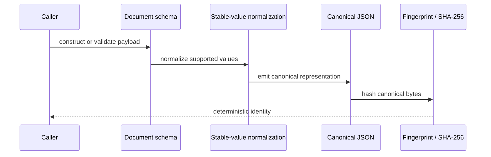
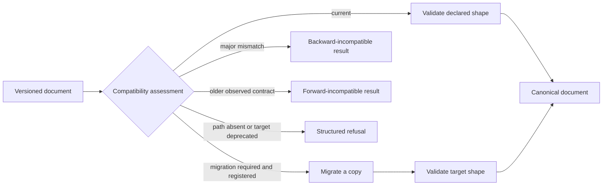

# Execution Model

Foundation does not run analyses, schedule work, or manage services. Its execution model is a deterministic contract pipeline: accept a typed value, validate it, encode it canonically, and produce a stable document or an explicit outcome.

## Canonical Document Path

Typed identifiers and Pydantic models establish the input boundary. Stable-value conversion handles supported scalar and scientific values before canonical JSON fixes key ordering and representation. Fingerprint helpers hash that canonical form, so a digest describes content rather than incidental dictionary order or process state.

Callers should retain both the schema version and digest with persisted material. The version answers how to read the document; the digest answers whether its canonical content changed.

| Evidence | Question it answers | Question it cannot answer |
| --- | --- | --- |
| validated model | does the payload satisfy the declared shape? | is the scientific interpretation correct? |
| schema version | which reading contract applies? | was the payload produced by a trusted source? |
| canonical JSON | is there one deterministic representation? | are two different schemas semantically equivalent? |
| SHA-256 fingerprint | did canonical content change? | is the content authentic or experimentally valid? |

## Compatibility Path

When a stored document uses another supported schema version, compatibility assessment identifies the relationship before any mutation occurs. A declared migration then moves the document between known shapes. Import migrations address approved historical module paths separately from schema migrations; neither mechanism guesses at unknown scientific meaning.

Compatibility and migration are related but independent. A version pair can
be classified even when no migration registry is available. A migration is
permitted only when a declared path reaches a non-deprecated target; it never
infers missing fields or repairs scientific meaning.

## Outcome Semantics

Invalid data, unsupported versions, missing optional capabilities, and policy refusals are distinct outcomes. The `outcomes` family preserves that distinction so downstream software can report, retry, or stop deliberately. Exceptions remain available where Python call semantics require them, while structured results carry machine-readable failure information across package and process boundaries.

Because foundation owns no CLI, HTTP application, artifact store, or run manager, those concerns must remain in runtime. A caller can use these primitives inside any execution environment without giving foundation control of that environment.

The shared result contract preserves three operational dispositions:

| Disposition | Required evidence | Forbidden combination |
| --- | --- | --- |
| success | supported state and optional output fingerprint | refusal or degradation reasons |
| degraded success | ambiguous, incomplete, or lossy state plus reasons | refusal |
| refused | refused state plus one structured refusal | degradation reasons |

This distinction prevents a lossy conversion from appearing as an ordinary
success and prevents a refusal from being flattened into an exception message.
