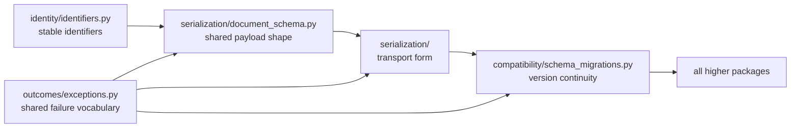

# Architecture

`bijux-proteomics-foundation` architecture is deliberately small, and that is
the point. This section explains how the package preserves stable meaning
across ids, schemas, serialization, and migrations without quietly absorbing
package-specific policy.

## Architectural Promise

- the same object should keep the same meaning while it moves between packages,
  artifacts, and versions
- version repair belongs here, but domain judgment does not
- the owner paths should stay explicit enough that a reviewer can find them
  without relying on wrapper history

## Start With

- open [Execution Model](https://bijux.io/bijux-proteomics/03-bijux-proteomics-foundation/architecture/execution-model/)
  when the question is how shared meaning survives transport and version change
- open [Integration Seams](https://bijux.io/bijux-proteomics/03-bijux-proteomics-foundation/architecture/integration-seams/)
  when a proposed helper starts to smell like package-specific policy
- open [Module Map](https://bijux.io/bijux-proteomics/03-bijux-proteomics-foundation/architecture/module-map/)
  when you need the exact owner quickly because the package is intentionally
  compact

## Reading Map

- [State and Persistence](https://bijux.io/bijux-proteomics/03-bijux-proteomics-foundation/architecture/state-and-persistence/)
  for what is allowed to become durable
- [Dependency Direction](https://bijux.io/bijux-proteomics/03-bijux-proteomics-foundation/architecture/dependency-direction/)
  and [Extensibility Model](https://bijux.io/bijux-proteomics/03-bijux-proteomics-foundation/architecture/extensibility-model/)
  for the rules that keep the package minimal
- [Error Model](https://bijux.io/bijux-proteomics/03-bijux-proteomics-foundation/architecture/error-model/)
  and [Architecture Risks](https://bijux.io/bijux-proteomics/03-bijux-proteomics-foundation/architecture/architecture-risks/)
  for the places hidden policy often tries to enter

## First Proof Check

- `src/bijux_proteomics_foundation/identity/identifiers.py` and `serialization/document_schema.py` for stable shared meaning
- `src/bijux_proteomics_foundation/serialization/` and `compatibility/schema_migrations.py` for transport and compatibility structure
- `src/bijux_proteomics_foundation/outcomes/exceptions.py` for shared failure vocabulary

## Boundary Test

If a new helper needs package-specific nouns to justify itself, it probably does
not belong in this architecture.
