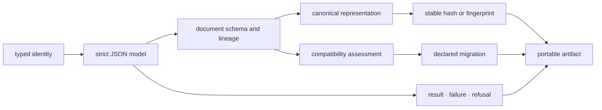
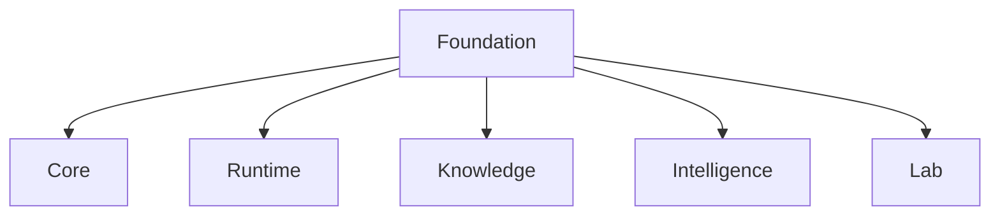
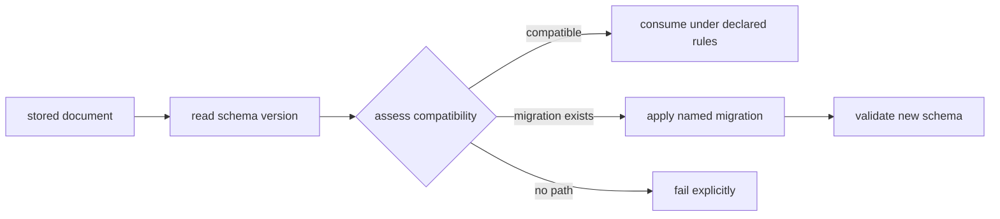

# Shared contract architecture

`bijux-proteomics-foundation` is a dependency-light kernel for meaning that must
survive package, process, artifact, and version boundaries. It owns typed
identity, strict JSON models, document metadata, canonical representation,
stable hashes, schema compatibility, declared migration, and portable outcome
vocabulary.

## Architectural families

| Family | Responsibility | Boundary |
| --- | --- | --- |
| `identity` | constrained identifiers and recognized kinds | identity syntax, not biological resolution |
| `serialization` | strict JSON models, document schema, canonical JSON, fingerprints, stable values and hashes | deterministic representation, not scientific truth |
| `compatibility` | schema versions, evolution assessment, migration registry, import migration support | declared transformation, not silent coercion |
| `outcomes` | results, error envelopes, refusals, optional-dependency failures | portable disposition, not domain recovery policy |
| `support` | provenance, lifecycle state, package charter and public API helpers | shared vocabulary, not product workflow state |
| `testing` | reusable repository contract checks | test infrastructure, not runtime product behavior |

The [module map](module-map.md) resolves these families to their exact owners.

## Dependency direction

The arrows represent allowed consumption of shared contracts. Foundation has
no outbound dependency on another product package. A downstream type does not
become foundational merely because several packages use similarly named
fields; the meaning must be neutral and identical without importing consumer
policy.

[Dependency direction](dependency-direction.md) and
[integration seams](integration-seams.md) define this boundary in detail.

## Representation and meaning

Canonical JSON normalizes supported values into deterministic bytes. A named
hash policy derives content identity from that representation. These guarantees
support equality checks, caches, manifests, and review lineage, but they do not
establish authenticity, provenance, semantic equivalence, or biological
validity.

Unsupported or ambiguous scientific values fail at the contract boundary
instead of acquiring a convenient string representation that may not round
trip. [State and persistence](state-and-persistence.md) documents durable
representation.

## Compatibility before migration

Schema identity is separate from package and import identity. Compatibility
assessment determines whether two document versions can interact. A migration
registry applies explicit, directional transformations and records failure when
no declared path exists. Import migrations handle renamed Python surfaces and
must not be confused with document evolution.

[Execution model](execution-model.md) follows this contract path;
[error model](error-model.md) distinguishes assessment, migration, validation,
and optional-dependency failures.

## Extension rules

A shared primitive is admitted only when multiple packages need identical
neutral meaning, Foundation can define it without a consumer dependency, and
central ownership prevents real semantic drift. Every new public contract needs
validation, serialization, compatibility, negative-path, and consumer evidence.

[Extensibility model](extensibility-model.md) provides the admission route.
[Architecture risks](architecture-risks.md) covers kernel expansion, convenience
exports, duplicate contracts, hidden policy, and migration shortcuts.
