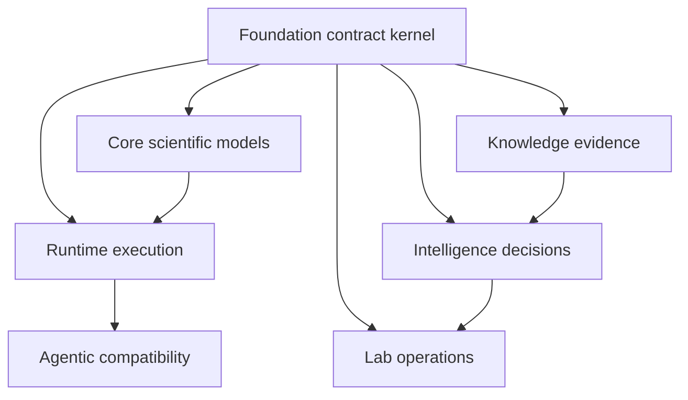

# Integration Seams

Foundation sits below every product package. Its seams are serialized and typed
agreements rather than workflow calls: downstream packages import shared
primitives, construct stricter domain models, and return shared outcome and
provenance shapes without moving domain policy into the kernel.

## Contract exchange

| Seam | Foundation provides | Consumer must preserve |
| --- | --- | --- |
| Identity | validated, stable identifier types | identity across joins, serialization, and package boundaries |
| JSON and ordering | deterministic model encoding and stable value order | governed field meaning and canonical input selection |
| Document schema | name, schema version, producer version, provenance metadata, and optional content hash | truthful producer identity, version policy, and payload-to-hash boundary |
| Compatibility | version comparison and registered migration paths | explicit migration functions and validation of transformed output |
| Fingerprints | typed scopes and deterministic SHA-256 calculation | the policy and scope used; no authenticity claim |
| Outcomes | success, degraded success, refusal, error, and support-state vocabulary | domain-specific reasons, evidence, and recoverability |
| Provenance | stable pointers to source and derived records | authorization and validation before dereferencing locations |

## Dependency direction

Foundation does not import product packages. Core, knowledge, intelligence, lab,
and runtime may depend on foundation primitives, but they add their own models
and rules above them. If foundation must import a downstream model to define a
new type, the type is not yet a kernel primitive.

The strongest boundary test is substitution: two consumers should be able to
use the foundation contract without importing each other or agreeing on one
consumer’s workflow. Shared touch is insufficient. For example, all packages
may mention confidence, but evidence trust, analytical confidence, provider
reliability, and assay readiness are different concepts and should not collapse
into one foundation score.

## Change impact

A foundation change is repository-wide. Review root exports, schema versions,
migration reachability, canonical serialization, hashes, fixtures, and every
downstream producer and consumer. Additive fields can still change fingerprints
and persisted representations. A rename can affect error paths and review
artifacts even when Python imports remain valid. Release the compatibility
story with the contract, not after downstream packages discover the drift.
