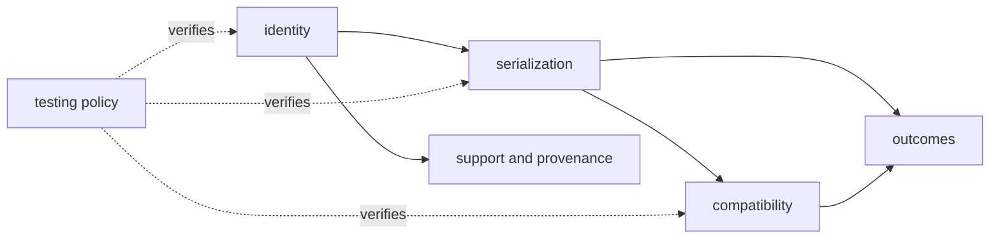

# Module Map

`bijux-proteomics-foundation` is the contract floor of the repository. It gives every higher package the same vocabulary for identity, deterministic documents, compatibility, and explicit outcomes without importing proteomics workflows into that vocabulary.

## Public contract

The package root exposes a deliberately narrow set of stable primitives. Identifier types distinguish runs, samples, spectra, peptides, proteins, claims, reviews, and artifacts without reducing every key to an interchangeable string. `DocumentSchema` and `JsonModel` define document shape. Canonical JSON, SHA-256 helpers, and fingerprint functions make the same logical value produce the same bytes and digest.

The root API is lazy: importing the package resolves public names only when they are used. This keeps the dependency floor small while preserving one discoverable import surface.

## Owned families

| Family | Responsibility | Representative modules |
| --- | --- | --- |
| `identity` | Typed, stable identifiers shared across package boundaries | `identifiers.py` |
| `serialization` | Canonical JSON, stable values, document schemas, fingerprints, and scientific-value encoding | `canonical_json.py`, `document_schema.py`, `fingerprints.py` |
| `compatibility` | Schema versions, migration plans, import migrations, and compatibility assessments | `schema_versions.py`, `schema_migrations.py`, `schema_assessments.py` |
| `outcomes` | Structured failures, refusals, results, exceptions, and optional-dependency errors | `failures.py`, `refusals.py`, `results.py` |
| `support` | Provenance records, lifecycle states, charter metadata, and API declaration support | `provenance.py`, `states.py`, `public_api.py` |
| `testing` | Reusable repository checks for public boundaries, generated files, skips, and source-tree limits | `public_function_type_boundaries.py`, `pytest_artifacts.py`, `source_tree_limits.py` |

## Boundary test

A concept belongs here only when several packages need exactly the same meaning and can use it without depending on a scientific workflow. Peptide scoring, experimental design, evidence review, and run execution remain with their owning packages. Foundation can represent their identifiers, documents, provenance, and failures; it does not decide their domain policy.
