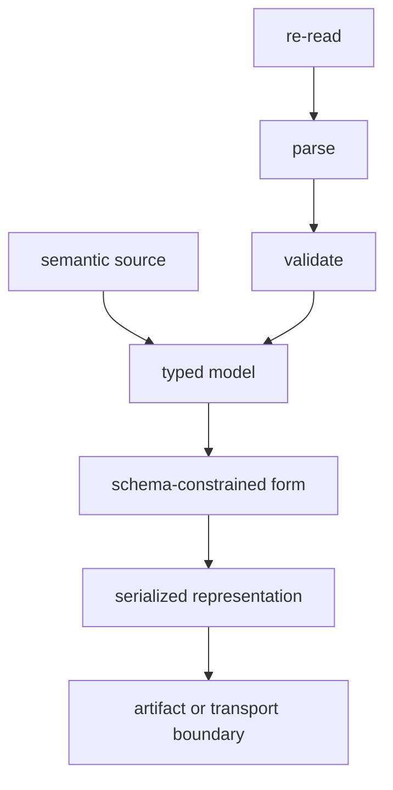

# State and Persistence

State in `bijux-proteomics-foundation` should be explicit enough that a maintainer can say what is
transient, what is serialized, and what neighboring packages must not assume.

That clarity matters because state tends to spread silently when it is not named.
Once readers stop knowing which outputs are durable and which values are local,
interface and operations pages quickly become less trustworthy.

Treat the architecture pages for `bijux-proteomics-foundation` as a reviewer-facing map of structure and flow. They should shorten code reading, not try to replace it.

## Visual Summary

## Durable Surfaces

- execution store records
- replay decision artifacts
- non-determinism policy evaluations

## Code Areas to Inspect

- `src/bijux_proteomics_foundation/model` for durable runtime models
- `src/bijux_proteomics_foundation/runtime` for execution engines and lifecycle logic
- `src/bijux_proteomics_foundation/application` for orchestration and replay coordination
- `src/bijux_proteomics_foundation/verification` for runtime-level validation support
- `src/bijux_proteomics_foundation/interfaces` for CLI surfaces and manifest loading
- `src/bijux_proteomics_foundation/api` for HTTP application surfaces

## Concrete Anchors

- `src/bijux_proteomics_foundation/model` for durable runtime models
- `src/bijux_proteomics_foundation/runtime` for execution engines and lifecycle logic
- `src/bijux_proteomics_foundation/application` for orchestration and replay coordination

## Use This Page When

- you are tracing structure, execution flow, or dependency pressure
- you need to understand how modules fit before refactoring
- you are reviewing design drift rather than one isolated bug

## Decision Rule

Use `State and Persistence` to decide whether a structural change makes `bijux-proteomics-foundation` easier or harder to explain in terms of modules, dependency direction, and execution flow. If the change works only because the design becomes harder to read, the safer answer is redesign rather than acceptance.

## What This Page Answers

- how `bijux-proteomics-foundation` is organized internally in terms a reviewer can follow
- which modules carry the main execution and dependency story
- where structural drift would show up before it becomes expensive

## Reviewer Lens

- trace the described execution path through the named modules instead of trusting the diagram alone
- look for dependency direction or layering that now contradicts the documented seam
- verify that the structural risks named here still match the current code shape

## Honesty Boundary

This page describes the current structural model of `bijux-proteomics-foundation`, but it does not guarantee that every import path or runtime path still obeys that model. Readers should treat it as a map that must stay aligned with code and tests, not as an authority above them.

## Next Checks

- move to interfaces when the review reaches a public or operator-facing seam
- move to operations when the concern becomes repeatable runtime behavior
- move to quality when you need proof that the documented structure is still protected

## Purpose

This page marks the package's state and artifact boundary.

## Stability

Keep it aligned with the actual artifact shapes and serialized outputs.
