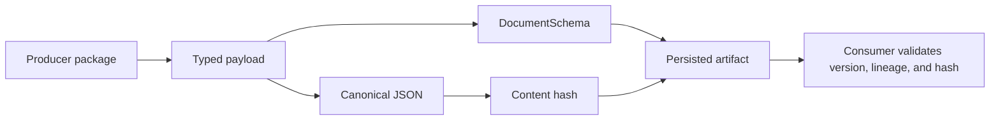

# State and Persistence

Foundation defines portable state contracts but does not operate a database, artifact store, or run ledger. Persisted documents remain owned by the package that gives them domain meaning.

## Durable contract elements

- typed identifiers retain entity meaning across package and storage boundaries;
- `DocumentSchema` records producer, package version, schema version, status, lineage, trace links, revision, timestamps, and optional content hash;
- canonical JSON defines the durable byte-level representation for supported values;
- hashes and fingerprints detect content change and support replay comparison;
- provenance pointers address files, records, references, documents, and artifacts without prescribing their storage backend;
- compatibility assessments and migrations keep known historical shapes readable.

## Ownership rules

Foundation can say how a document identifies and describes itself. It cannot decide retention, access control, database indexing, artifact layout, or when a domain record becomes authoritative. Runtime owns operational persistence; knowledge owns evidence memory; lab owns planning and outcome state; intelligence owns decision records.

Timestamps, trace identifiers, and mutable status are audit metadata. Callers must not accidentally include volatile metadata in a content fingerprint intended to identify stable scientific payload. Conversely, omitting schema version or lineage from a stored artifact makes later interpretation unsafe even when the payload still parses.

## Define the fingerprint boundary

| Field class | Content identity | Artifact envelope | Reason |
| --- | --- | --- | --- |
| canonical scientific payload | include | include or reference | defines the represented value |
| units, entity identifiers, and declared semantics | include | include | prevents equal bytes from hiding different meaning |
| schema and canonicalization policy | bind through a versioned contract | include explicitly | determines how bytes are interpreted |
| parent content identities and transformation parameters | include when they define the derived value | include explicitly | preserves derivation and comparison scope |
| producer, source URI, and custody events | exclude unless domain identity requires them | include | establishes provenance without making a copied artifact a new value |
| creation time, trace identifier, storage path, and access metadata | exclude | include when useful | volatile custody must not destabilize scientific equality |
| mutable review or publication status | exclude from immutable content identity | append as a new envelope or linked decision | status changes without changing the underlying payload |

The governing domain must document any exception. A hash with an unspecified
field boundary is not a portable identity: reviewers cannot tell whether a
change reflects scientific content, serialization policy, or incidental
custody metadata.
