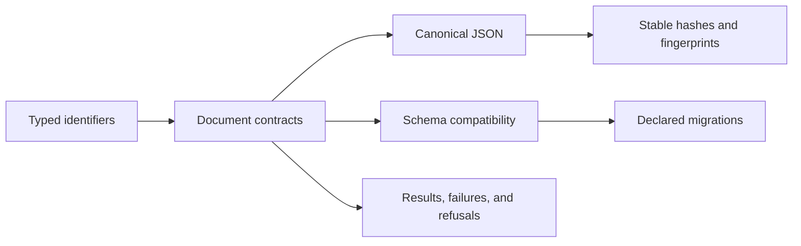

# Capability Map

`bijux-proteomics-foundation` supplies the smallest contracts that must mean the same thing everywhere in the package family. Its value is not scientific breadth; it is stable identity, deterministic representation, explicit compatibility, and portable outcomes.

## Kernel capabilities

| Capability | Public examples | Guarantee |
| --- | --- | --- |
| Shared identity | `ProgramId`, `TargetId`, `CandidateId`, `EvidenceId`, `ClaimId`, `AssayId`, `BatchId`, `GateId` | Semantically different identifiers remain distinguishable across packages |
| JSON contracts | `JsonModel` | Strict, serializable Pydantic models with a common boundary |
| Document metadata | `DocumentSchema` | Producer, version, lineage, revision, status, timestamps, and optional content hash travel with durable documents |
| Canonical representation | `to_canonical_json` | Logically equal supported values produce one stable JSON form |
| Integrity | `hash_text`, `hash_payload`, `hash_model`, `fingerprint_model` | Content identity is derived from stable representation rather than process state |
| Compatibility | schema versions, assessments, and migrations | Version relationships are evaluated before transformation |
| Outcomes | results, failures, refusals, optional-dependency errors | Consumers can distinguish invalidity, policy refusal, and unavailable capability |
| Provenance and state | support contracts | Cross-package lineage and lifecycle vocabulary remain portable |

The curated root API is budgeted to fifteen kernel exports. More specialized helpers live under their owner modules rather than turning the package root into a convenience namespace.

## Outside the kernel

Foundation does not interpret spectra, rank candidates, resolve biological evidence, plan assays, or run services. A type belongs here only when multiple packages require the same neutral meaning and can use it without importing one consumer’s scientific or operational policy.
