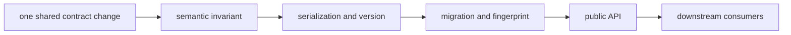

# Change principles

Foundation changes alter vocabulary shared by independently released packages.
The safe unit is one explicit contract change with its serialization,
migration, fingerprint, public API, and consumer consequences reviewed together.

## Classify the change

| Change class | Typical example | Required treatment |
| --- | --- | --- |
| semantic | identifier equality, outcome meaning, provenance field | new meaning, invariant proof, every affected consumer |
| serialized | canonical JSON, document field, ordering | byte fixtures, schema version, old/new readers |
| migratory | registered version transformation or import alias | source/target fixtures, loss policy, unsupported path |
| identity | stable value or fingerprint scope | equal-meaning and changed-meaning cases, cache consumers |
| public API | export, signature, package alias | API guard, typing, import boundary, downstream imports |
| implementation | internal algorithm with unchanged public meaning | local equivalence and performance proof |

## Durable rules

- prefer explicit rejection over permissive coercion;
- version a changed persisted meaning instead of teaching readers to guess;
- preserve provenance through normalization and migration;
- keep byte, value, schema, and import stability as separate promises;
- move scientific or operational policy to its owning package;
- add a shared primitive only when at least two consumers need the same neutral
  meaning, not merely a similar field name; and
- release compatibility evidence with the contract change.

## Breaking changes

A source-compatible change can still be semantically breaking when defaults,
normalization, outcome classification, fingerprint scope, or serialized bytes
move. Record the old and new meaning and provide an explicit migration or
rejection. Silent acceptance is not backward compatibility.

Use [change validation](../quality/change-validation.md) for proof selection and
[known limitations](../quality/known-limitations.md) for the guarantee boundary.
