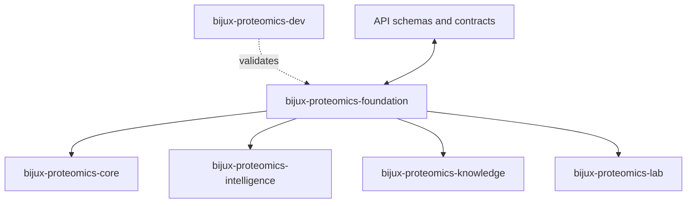

# Dependencies and Adjacencies

Dependencies and adjacencies explain what `bijux-proteomics-foundation` can do by itself and
what it deliberately leans on. They are part of the package story, not just
implementation trivia, because they show where local authority ends.

This page should help a reviewer see both kinds of dependency pressure: library
dependencies that shape the implementation, and neighboring packages that shape
the system boundary.

Treat the foundation pages for `bijux-proteomics-foundation` as the package's durable self-description. If the package still feels blurry after this section, the boundary story is not clear enough yet.

## Visual Summary

## Direct Dependency Themes

- agentic-proteins
- bijux-proteomics-foundation
- bijux-proteomics-intelligence
- bijux-proteomics-core
- duckdb
- pydantic

## Adjacent Package Relationships

- governs the other canonical packages instead of replacing their local ownership
- is the final authority for run acceptance, replay evaluation, and stored evidence

## Concrete Anchors

- `packages/bijux-proteomics-foundation` as the package root
- `packages/bijux-proteomics-foundation/src/bijux_proteomics_foundation` as the import boundary
- `packages/bijux-proteomics-foundation/tests` as the package proof surface

## Use This Page When

- you need the package idea before the implementation detail
- you are deciding whether work belongs here or in a neighboring package
- you want the shortest honest explanation of what this package is for

## Decision Rule

Use `Dependencies and Adjacencies` to decide whether a change makes `bijux-proteomics-foundation` easier or harder to defend as one distinct role in the overall system. If the work makes the package broader without making its role clearer, stop and re-check the boundary before treating the change as a local improvement.

## What This Page Answers

- what problem `bijux-proteomics-foundation` is supposed to own on purpose
- where the package boundary stops, even when nearby code looks tempting
- which neighboring package seams deserve comparison before the boundary is changed

## Reviewer Lens

- compare the stated boundary with the modules, artifacts, and tests that are supposed to uphold it
- check that out-of-scope behavior is not quietly re-entering through convenience paths
- confirm that the package story still matches the real repository layout and neighboring package docs

## Honesty Boundary

This page can explain the intended boundary of `bijux-proteomics-foundation`, but it cannot prove that boundary by itself. The real proof still lives in the code, tests, and neighboring package seams that either support or contradict the story told here.

## Next Checks

- move to architecture when the question becomes structural rather than boundary-oriented
- move to interfaces when the question becomes contract-facing
- move to quality when the question becomes proof or review sufficiency

## Purpose

This page explains which surrounding tools and packages `bijux-proteomics-foundation` depends on to do its job.

## Stability

Keep it aligned with `pyproject.toml` and the actual package seams.
