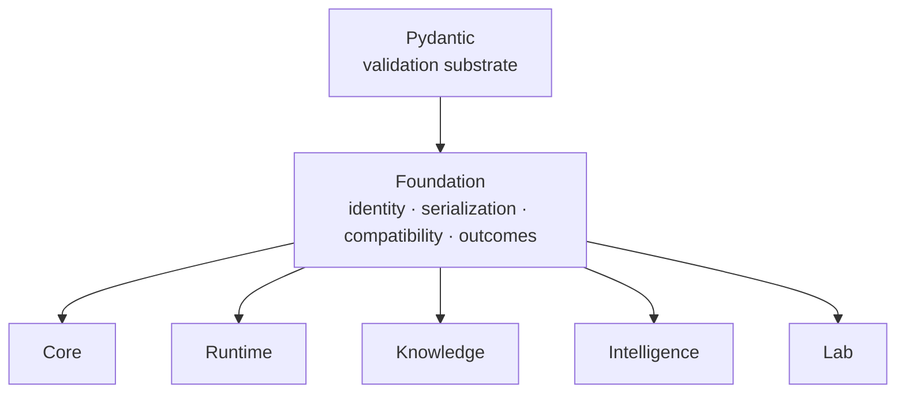

# Dependencies and adjacencies

Foundation is the base of the product dependency graph. Its only runtime
library dependency is Pydantic; it has no dependency on another Bijux
Proteomics product package. This is a semantic constraint, not merely a small
installation preference: every product package must be able to consume shared
identity and document contracts without importing a higher-level domain.

The arrows are Python dependency direction. Scientific and operational records
move among the consumers, but none of those consumers may become a prerequisite
for interpreting a Foundation contract.

## Dependency contract

| Dependency class | Allowed use | Boundary |
| --- | --- | --- |
| standard library | deterministic value handling, typing, and serialization support | no ambient machine or network state in canonical meaning |
| Pydantic | strict models, validation, and structured serialization | Foundation owns its public document behavior rather than exposing framework internals as the contract |
| product packages | none | a shared primitive cannot require Core, Runtime, Knowledge, Intelligence, or Lab to define itself |
| optional scientific libraries | test-only comparison where explicitly declared | no scientific library may become necessary to import or validate the public kernel |

## Consumer adjacencies

Adjacency describes who uses a contract; it does not make Foundation the owner
of the consumer’s domain.

| Consumer | Foundation supplies | Consumer still owns |
| --- | --- | --- |
| Core | identifiers, `JsonModel`, document schemas, canonical bytes, hashes | scientific entities, calculations, policies, and acceptance |
| Runtime | portable identities, typed outcomes, stable persisted representation | providers, lifecycle, checkpoints, artifacts, and comparison |
| Knowledge | evidence and claim identifiers, stable document envelopes | source context, grounding, reconciliation, and sufficiency |
| Intelligence | candidate and review identities, canonical decision inputs | ranking, challenge, confidence, and refusal policy |
| Lab | assay, batch, program, and gate identities; portable handoff records | readiness, scheduling, observation, and consequence |

## When a contract belongs here

A type or rule belongs in Foundation only when all of these are true:

1. more than one product package requires exactly the same meaning;
2. the meaning is valid without a scientific algorithm or workflow policy;
3. canonical representation can be specified independently of a producer;
4. compatibility and failure behavior can be governed for every consumer;
5. adding the contract does not introduce a product-package dependency.

If consumers need similar fields but apply different interpretation, keep the
domain types with their owners and share only the stable identity or envelope.

## Boundary failures

| Smell | Why it is unsafe | Correct owner |
| --- | --- | --- |
| an identifier validates biological truth | identity becomes coupled to one scientific interpretation | Core or Knowledge |
| a schema decides whether a run succeeded scientifically | serialization absorbs execution or acceptance policy | Runtime or Core |
| a shared outcome ranks candidates | an interchange type becomes decision policy | Intelligence |
| a document migration changes assay readiness | compatibility rewrites operational meaning | Lab |
| canonicalization reads environment or network state | equal content can produce different bytes | remove ambient dependency |

Use [data contracts](../interfaces/data-contracts.md) for the public shapes,
[compatibility commitments](../interfaces/compatibility-commitments.md) for
schema evolution, and [dependency governance](../quality/dependency-governance.md)
when a new library or product edge is proposed.
