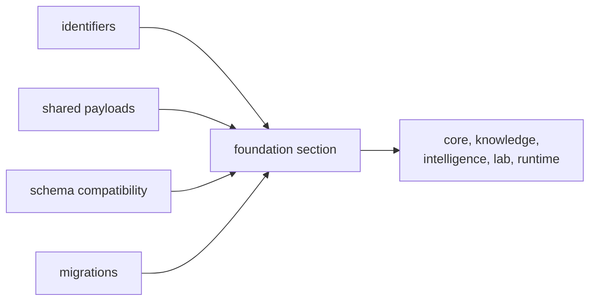

# Foundation

The foundation section exists to keep shared primitives narrow and durable:
identifiers, schema compatibility, canonical serialization, and cross-package
invariants. If a page here needs recommendation posture, runtime delivery, or
lab consequence to justify itself, the page is already pointing at the wrong
owner.

That narrowness matters more now because the repository carries much deeper
scientific, runtime, and review surfaces than it did before. The more real
workflow and evidence depth downstream packages own, the more expensive it
becomes to let shared identifiers, canonical serialization, deterministic
hashing, or document meaning drift.

## What This Section Protects

- one shared identifier and document grammar across all product packages
- deterministic serialization and hashing that survive package boundaries
- migration-safe invariants that downstream owners can consume without rewriting
  primitive meaning

## Why This Section Is Small On Purpose

- foundation exists to settle shared primitive meaning before downstream policy
  begins
- deeper scientific packages make cross-package invariants more valuable, not
  less
- keeping this section narrow prevents recommendation posture, execution
  behavior, and lab consequence from leaking into the shared substrate

## Start With

- Open [Package Overview](https://bijux.io/bijux-proteomics/03-bijux-proteomics-foundation/foundation/package-overview/) for the shortest statement of
  the package role.
- Open [Ownership Boundary](https://bijux.io/bijux-proteomics/03-bijux-proteomics-foundation/foundation/ownership-boundary/) when the question is
  whether a change belongs here or in a neighbor.
- Open [This Package Does Not Own](https://bijux.io/bijux-proteomics/03-bijux-proteomics-foundation/this-package-does-not-own/)
  when the question is whether a proposal is trying to smuggle product or
  review behavior into shared primitives.
- Open [Scope and Non-Goals](https://bijux.io/bijux-proteomics/03-bijux-proteomics-foundation/foundation/scope-and-non-goals/) when a proposed change
  risks broadening the package.
- Open [Capability Map](https://bijux.io/bijux-proteomics/03-bijux-proteomics-foundation/foundation/capability-map/) when you need the concrete work
  the package is allowed to do.

## Section Pages

- [Package Overview](https://bijux.io/bijux-proteomics/03-bijux-proteomics-foundation/foundation/package-overview/)
- [Scope and Non-Goals](https://bijux.io/bijux-proteomics/03-bijux-proteomics-foundation/foundation/scope-and-non-goals/)
- [Ownership Boundary](https://bijux.io/bijux-proteomics/03-bijux-proteomics-foundation/foundation/ownership-boundary/)
- [This Package Does Not Own](https://bijux.io/bijux-proteomics/03-bijux-proteomics-foundation/this-package-does-not-own/)
- [Capability Map](https://bijux.io/bijux-proteomics/03-bijux-proteomics-foundation/foundation/capability-map/)
- [Dependencies and Adjacencies](https://bijux.io/bijux-proteomics/03-bijux-proteomics-foundation/foundation/dependencies-and-adjacencies/)
- [Repository Fit](https://bijux.io/bijux-proteomics/03-bijux-proteomics-foundation/foundation/repository-fit/)
- [Lifecycle Overview](https://bijux.io/bijux-proteomics/03-bijux-proteomics-foundation/foundation/lifecycle-overview/)
- [Domain Language](https://bijux.io/bijux-proteomics/03-bijux-proteomics-foundation/foundation/domain-language/)
- [Change Principles](https://bijux.io/bijux-proteomics/03-bijux-proteomics-foundation/foundation/change-principles/)

## What This Section Settles

- whether a rule is truly a shared primitive instead of lifecycle, evidence,
  recommendation, or execution logic
- which invariants every package must share before local owner policy begins
- when a migration helper is justified versus when a higher package should own
  the change directly

## Strongest Foundation Proof

- start with
  [Package Overview](https://bijux.io/bijux-proteomics/03-bijux-proteomics-foundation/foundation/package-overview/)
  for the shortest owner statement
- continue to
  [Ownership Boundary](https://bijux.io/bijux-proteomics/03-bijux-proteomics-foundation/foundation/ownership-boundary/)
  when the real question is whether a proposal crosses into downstream policy
- open
  [This Package Does Not Own](https://bijux.io/bijux-proteomics/03-bijux-proteomics-foundation/this-package-does-not-own/)
  when someone is trying to move recommendation posture, runtime behavior, or
  lab consequence into shared primitives

## First Proof Check

- `packages/bijux-proteomics-foundation/src/bijux_proteomics_foundation`
- `packages/bijux-proteomics-foundation/tests`
- neighboring handbooks once the change crosses the local boundary

## Neighbors

- Open [bijux-proteomics-core](https://bijux.io/bijux-proteomics/04-bijux-proteomics-core/)
  when the question leaves shared payload meaning, identifiers, and deterministic serialization.
- Open [bijux-proteomics-runtime](https://bijux.io/bijux-proteomics/09-bijux-proteomics-runtime/)
  when the issue is clearly outside this package's local role.
