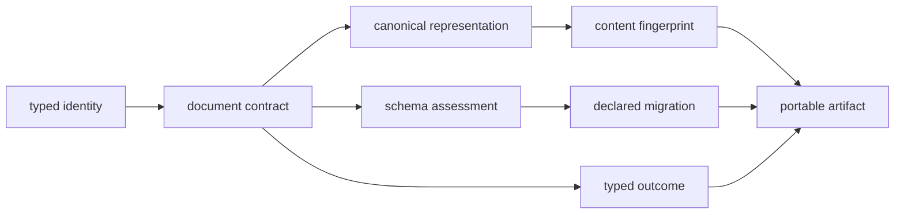
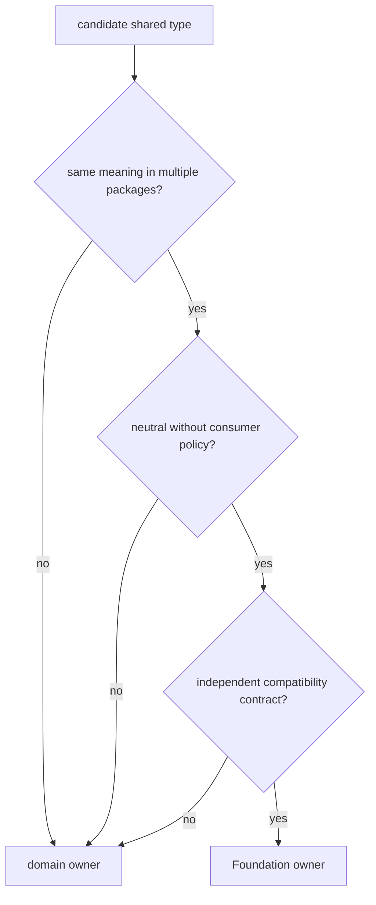

# Shared contract foundations

Foundation owns values that must retain exactly the same meaning across the
package family. It stays dependency-light so Core, Runtime, Knowledge,
Intelligence, and Lab can exchange durable documents without importing one
another's scientific or operational policy.

## Contract routes

| Question | Guide | Governing boundary |
| --- | --- | --- |
| What is the package for? | [Package overview](package-overview.md) | neutral cross-package primitives |
| Does a proposed type belong here? | [Ownership boundary](ownership-boundary.md) | shared meaning without consumer policy |
| What is deliberately excluded? | [Scope and non-goals](scope-and-non-goals.md) | scientific and operational ownership |
| Which primitives are available? | [Capability map](capability-map.md) | identity, serialization, compatibility, outcomes |
| Which dependencies are acceptable? | [Dependencies and adjacencies](dependencies-and-adjacencies.md) | dependency-light kernel |
| How may a contract evolve? | [Change principles](change-principles.md) | compatibility before migration |

[This package does not own](../this-package-does-not-own.md) provides concrete
counterexamples when a proposal would move workflow, evidence, recommendation,
execution, or laboratory policy into the shared substrate.

## Admission test

A model or helper belongs in Foundation only when every answer below is yes:

1. Do at least two product packages require the same meaning?
2. Can that meaning be defined without importing a consumer package?
3. Is the contract neutral about scientific interpretation and execution
   policy?
4. Can compatibility be assessed independently of a particular workflow?
5. Does central ownership reduce semantic drift rather than create a convenience
   dependency?

If a type contains spectrum interpretation, provider lifecycle, evidence
weighting, candidate ranking, assay feasibility, or laboratory authority, its
owner is downstream even when several packages need projections of it.

## Invariants protected at the boundary

- Identifier kinds remain distinguishable and validated across documents.
- Canonical JSON is deterministic for supported values.
- Hashes and fingerprints identify canonical content under a named policy.
- Schema assessment precedes migration; migration is explicit and directional.
- Results, failures, refusals, and unavailable optional dependencies remain
  distinct outcomes.
- Provenance and lifecycle vocabulary remain portable without claiming
  scientific truth.

These guarantees are intentionally limited. A stable fingerprint proves
content identity, not authenticity, correctness, or biological validity. A
schema-compatible document can still contain weak evidence. A typed success can
still represent a scientifically bounded result.

## Dependency and evolution rules

Foundation has no outbound dependency on another Bijux Proteomics product
package. Consumers may import Foundation contracts, but they retain ownership
of domain validation and policy. Compatibility aliases and migrations are
declared, tested, and documented; silent coercion is not part of the contract.

The [domain language](domain-language.md) defines the vocabulary used in these
decisions. [Repository fit](repository-fit.md) and
[lifecycle overview](lifecycle-overview.md) connect contract ownership to the
wider package family and release lifecycle.

Continue to the [Core handbook](../../04-bijux-proteomics-core/index.md) for
scientific models and algorithms, or the
[Runtime handbook](../../09-bijux-proteomics-runtime/index.md) for execution and
run-state contracts.
