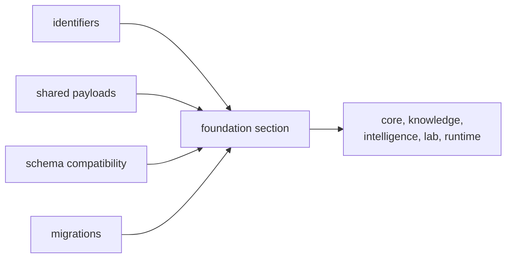

# Foundation

The foundation section explains the durable role of `bijux-proteomics-foundation` before it
explains implementation detail. Use it to resolve why shared meaning belongs here before downstream packages add policy or execution.

## What This Section Protects

- one family-level meaning for shared objects and records
- visible migration discipline instead of silent schema drift
- a clean handoff from common semantics to downstream policy and execution

## Start With

- Open [Package Overview](https://bijux.io/bijux-proteomics/03-bijux-proteomics-foundation/foundation/package-overview/) for the shortest statement of
  the package role.
- Open [Ownership Boundary](https://bijux.io/bijux-proteomics/03-bijux-proteomics-foundation/foundation/ownership-boundary/) when the question is
  whether a change belongs here or in a neighbor.
- Open [Scope and Non-Goals](https://bijux.io/bijux-proteomics/03-bijux-proteomics-foundation/foundation/scope-and-non-goals/) when a proposed change
  risks broadening the package.
- Open [Capability Map](https://bijux.io/bijux-proteomics/03-bijux-proteomics-foundation/foundation/capability-map/) when you need the concrete work
  the package is allowed to do.

## Section Pages

- [Package Overview](https://bijux.io/bijux-proteomics/03-bijux-proteomics-foundation/foundation/package-overview/)
- [Scope and Non-Goals](https://bijux.io/bijux-proteomics/03-bijux-proteomics-foundation/foundation/scope-and-non-goals/)
- [Ownership Boundary](https://bijux.io/bijux-proteomics/03-bijux-proteomics-foundation/foundation/ownership-boundary/)
- [Capability Map](https://bijux.io/bijux-proteomics/03-bijux-proteomics-foundation/foundation/capability-map/)
- [Dependencies and Adjacencies](https://bijux.io/bijux-proteomics/03-bijux-proteomics-foundation/foundation/dependencies-and-adjacencies/)
- [Repository Fit](https://bijux.io/bijux-proteomics/03-bijux-proteomics-foundation/foundation/repository-fit/)
- [Lifecycle Overview](https://bijux.io/bijux-proteomics/03-bijux-proteomics-foundation/foundation/lifecycle-overview/)
- [Domain Language](https://bijux.io/bijux-proteomics/03-bijux-proteomics-foundation/foundation/domain-language/)
- [Change Principles](https://bijux.io/bijux-proteomics/03-bijux-proteomics-foundation/foundation/change-principles/)

## What This Section Settles

- why a concern belongs in shared meaning instead of in a downstream package
- when compatibility pressure justifies a foundation-layer change
- how much downstream code should be allowed to depend on shared primitives

## First Proof Check

- `packages/bijux-proteomics-foundation/src/bijux_proteomics_foundation`
- `packages/bijux-proteomics-foundation/tests`
- neighboring handbooks once the change crosses the local boundary

## Neighbors

- Open [bijux-proteomics-core](https://bijux.io/bijux-proteomics/04-bijux-proteomics-core/)
  when the question leaves shared payload meaning, identifiers, and deterministic serialization.
- Open [bijux-proteomics-runtime](https://bijux.io/bijux-proteomics/09-bijux-proteomics-runtime/)
  when the issue is clearly outside this package's local role.
