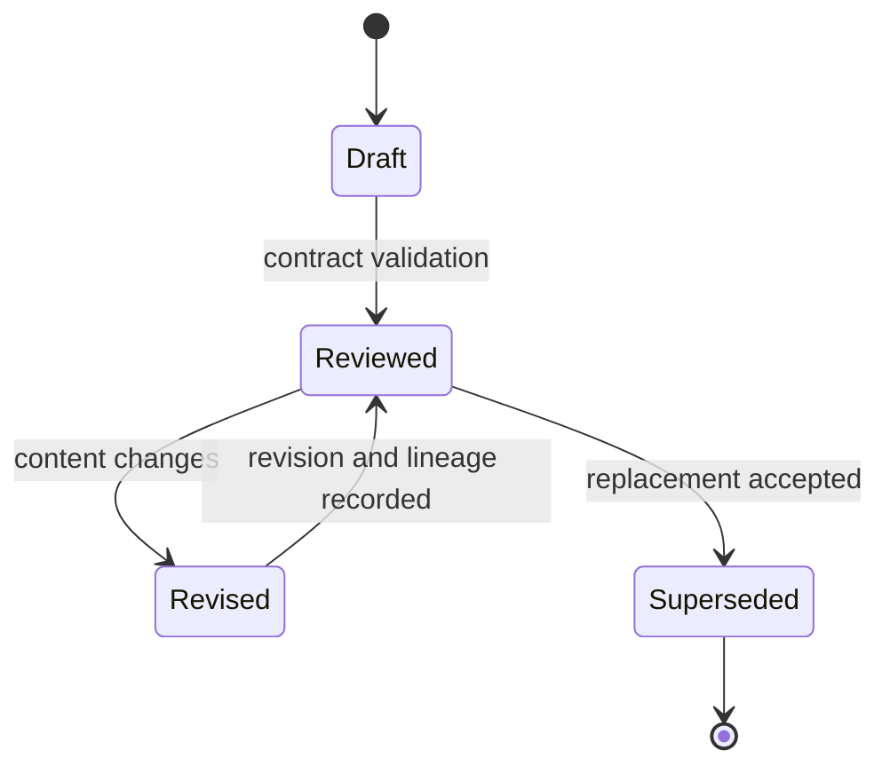
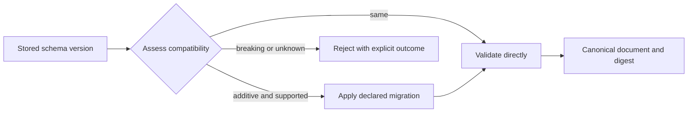

# Lifecycle Overview

Foundation contracts outlive individual workflows. Their lifecycle therefore separates document revision, schema evolution, content identity, and package release versioning.

## Document lifecycle

`DocumentSchema` carries a normalized schema version, producer, source system, document identity and kind, package version, lifecycle status, derivation links, trace links, timestamps, revision, tags, and optional content hash. `touch()` records the actor and advances the revision; `with_content_hash()` binds metadata to canonical payload content.

A revision changes one document instance. A schema migration changes the shape expected for a class of documents. Those events are related but not interchangeable: updating content must not impersonate a schema version change, and migrating shape must preserve enough lineage to explain the new document.

## Schema lifecycle

Schema versions use normalized `major.minor.patch` form. Compatibility helpers can recognize supported additive evolution within a major version; migrations remain declared transformations, not best-effort guessing. Import-path migrations are handled separately because Python symbol routing and persisted document shape are different contracts.

Existing hashes, fingerprints, and identifiers must retain their meaning across compatible releases. Any intentional break requires a major schema decision, migration guidance, and downstream verification across every consumer of the affected contract.
