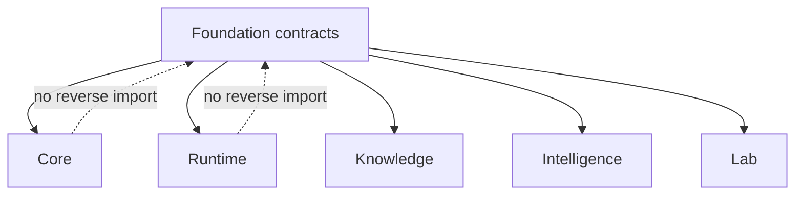

# Ownership Boundary

Foundation owns low-volatility contracts whose meaning must remain identical
across product packages. It provides representation, identity, provenance,
compatibility, and portable outcomes without interpreting scientific evidence
or controlling work.

## Owned Contracts

| Surface | Foundation authority |
| --- | --- |
| identifiers | constrained types, stable prefixes, construction and classification |
| JSON models | strict validation and portable serialization behavior |
| document metadata | producer, schema, lifecycle, revision, lineage, and content identity |
| canonical values and hashes | deterministic representation under a named policy |
| provenance | shared source and derivation primitives |
| compatibility | schema versions, assessments, migration paths, deprecation |
| outcomes | refusals, error envelopes, exceptions, and portable dispositions |

## Refused Ownership

Foundation does not own scientific parsers, algorithms, benchmarks, run state,
providers, evidence truth, recommendation policy, assay feasibility, or
repository automation. It may define a portable field used by those concerns;
the consuming package owns what that field means in its domain decision.

## Placement Test

Keep a change here only when multiple canonical packages require the same
meaning and a downstream owner would create reverse dependency or semantic
forking. Move it downstream when the rule depends on workflow family,
scientific method, execution state, evidence interpretation, decision posture,
or laboratory consequence.

Shared use alone is insufficient. A helper used in several packages can still
belong to the package whose decision it implements.

## Stability Burden

Foundation changes have repository-wide compatibility radius. Review public
imports, schemas, canonical bytes, hashes, migrations, old artifacts, and every
affected consumer together. A locally tidy abstraction is unacceptable when it
forces downstream packages to reinterpret an existing durable contract.
