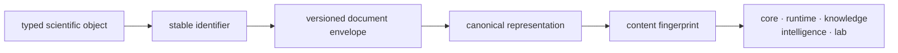

# Package Overview

`bijux-proteomics-foundation` owns the low-volatility meaning that every other
package consumes before it can do anything scientific: identifiers, shared
payload schemas, canonical JSON, deterministic fingerprints, compatibility
profiles, and outcome-safe document evolution.

The package is intentionally narrow, but it is not a placeholder. The broader
scientific product only stays coherent because every downstream owner can rely
on one stable family of identifiers, one serialization story, and one
compatibility discipline instead of inventing local dialects.

## The Stability Problem It Solves

A scientific object can cross five package boundaries before it becomes a
reviewed laboratory consequence. If each boundary invents its own identifier,
version test, or JSON rendering, two records can look interchangeable while
referring to different content. Foundation makes those low-level questions
answerable before any package evaluates biological meaning.

The fingerprint closes a content-identity question. The schema version closes
a readability question. Provenance and scientific acceptance remain separate
questions owned by the packages that produce and interpret the record.

## Owned Contract Surfaces

| Owner surface | Contract | Why readers should care |
| --- | --- | --- |
| `identity` | stable identifiers and typed keys | downstream packages can refer to the same scientific objects without drift |
| `compatibility` | schema profiles, version checks, and upgrade discipline | release and migration language can stay honest |
| `serialization` | canonical JSON, stable rendering, and reproducible hashing | artifacts can be compared, replayed, and audited repeatably |
| `outcomes` | shared outcome carriers and result-shape primitives | outcome state stays family-compatible instead of becoming package-local prose |
| `support` and `testing` | common helpers and test-facing primitives | invariants are enforced consistently across packages |

## What It Owns

- define shared identifiers
- govern schema profiles and serialization compatibility
- carry deterministic hashing and payload fingerprint rules
- carry migration helpers for payload evolution and cross-package invariants
- expose shared outcome and support primitives that let downstream packages
  exchange state without rewriting the family contract

## What It Refuses

- program lifecycle or benchmark-acceptance policy
- evidence truth, contradiction handling, or recommendation posture
- execution orchestration, replay, or assay consequence logic

## What Readers Commonly Underestimate

- this package is the reason runtime rerun artifacts and knowledge-review
  artifacts can be compared without local translation glue
- this package keeps release upgrades from silently changing the meaning of
  payloads that later look "compatible" only because tests stayed shallow
- this package owns the family contract below the biological and analytical
  story, not above it

## Decide Whether Foundation Owns The Question

| Question | Foundation answer | Continue with |
| --- | --- | --- |
| Are these identifiers well formed and classifiable? | yes | [Data contracts](../interfaces/data-contracts.md) |
| Are these documents readable under the same schema policy? | yes | [Compatibility commitments](../interfaces/compatibility-commitments.md) |
| Did canonical content change? | yes | [Execution model](../architecture/execution-model.md) |
| Is the content scientifically correct? | no | [Core](../../04-bijux-proteomics-core/index.md) |
| Is the supporting evidence sufficient for a claim? | no | [Knowledge](../../06-bijux-proteomics-knowledge/index.md) |
| Should the result change an experimental action? | no | [Intelligence](../../05-bijux-proteomics-intelligence/index.md) and [Lab](../../07-bijux-proteomics-lab/index.md) |

Foundation review is complete when the identifier class, schema version,
canonical representation, compatibility verdict, and failure disposition are
explicit. Passing that review does not promote the payload's scientific claim.
