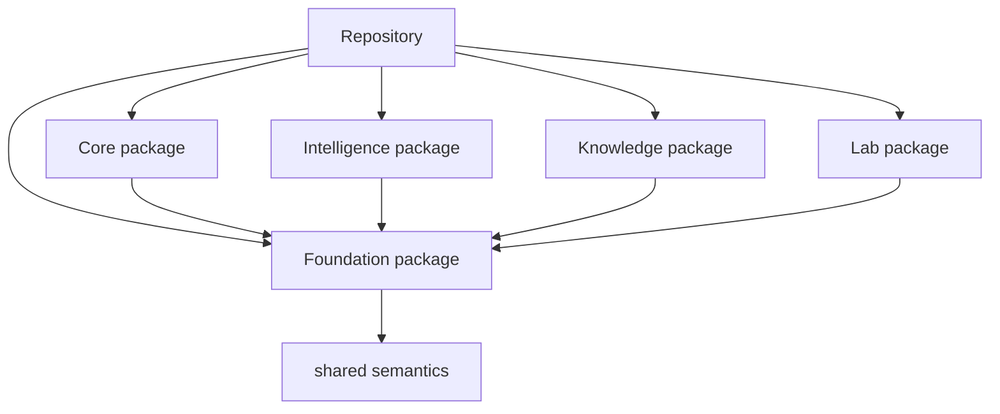

# Repository Fit

`bijux-proteomics-foundation` is one publishable part of a larger system. It sits in the
monorepo with its own `src/`, tests, metadata, and release history because the
repository wants package ownership to stay visible even when the packages evolve
together.

This page is here to answer a simple but important question: why is this work a
package at all, instead of just another folder inside a single giant project?

Treat the foundation pages for `bijux-proteomics-foundation` as the package's durable self-description. If the package still feels blurry after this section, the boundary story is not clear enough yet.

## Visual Summary

## Repository Relationships

- governs the other canonical packages instead of replacing their local ownership
- is the final authority for run acceptance, replay evaluation, and stored evidence

## Canonical Package Root

- `packages/bijux-proteomics-foundation`
- `packages/bijux-proteomics-foundation/src/bijux_proteomics_foundation`
- `packages/bijux-proteomics-foundation/tests`

## Concrete Anchors

- `packages/bijux-proteomics-foundation` as the package root
- `packages/bijux-proteomics-foundation/src/bijux_proteomics_foundation` as the import boundary
- `packages/bijux-proteomics-foundation/tests` as the package proof surface

## Use This Page When

- you need the package idea before the implementation detail
- you are deciding whether work belongs here or in a neighboring package
- you want the shortest honest explanation of what this package is for

## Decision Rule

Use `Repository Fit` to decide whether a change makes `bijux-proteomics-foundation` easier or harder to defend as one distinct role in the overall system. If the work makes the package broader without making its role clearer, stop and re-check the boundary before treating the change as a local improvement.

## What This Page Answers

- what problem `bijux-proteomics-foundation` is supposed to own on purpose
- where the package boundary stops, even when nearby code looks tempting
- which neighboring package seams deserve comparison before the boundary is changed

## Reviewer Lens

- compare the stated boundary with the modules, artifacts, and tests that are supposed to uphold it
- check that out-of-scope behavior is not quietly re-entering through convenience paths
- confirm that the package story still matches the real repository layout and neighboring package docs

## Honesty Boundary

This page can explain the intended boundary of `bijux-proteomics-foundation`, but it cannot prove that boundary by itself. The real proof still lives in the code, tests, and neighboring package seams that either support or contradict the story told here.

## Next Checks

- move to architecture when the question becomes structural rather than boundary-oriented
- move to interfaces when the question becomes contract-facing
- move to quality when the question becomes proof or review sufficiency

## Purpose

This page explains how the package fits into the repository without restating repository-wide rules.

## Stability

Keep it aligned with the package's checked-in directories and actual neighboring packages.
