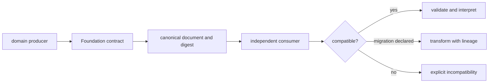

# Repository fit

Foundation exists so a record can leave its producing package without losing
identity, canonical content, schema posture, or disposition. It is the shared
language beneath the scientific workflow—not a generic utilities package and
not a reduced copy of the domain models above it.

## Why a separate package exists

Without a separate kernel, each product package would need to choose between
duplicating identifiers and serialization rules or importing a larger neighbor
whose domain it does not own. Both choices make persisted records fragile. The
Foundation package provides a dependency-light meeting point that remains
usable by producers, consumers, migration tools, and independent validators.

## Owned surfaces

| Surface | Repository value |
| --- | --- |
| `identity` | package-neutral identifiers for subjects shared across records |
| `serialization` | strict models, canonical JSON, stable values, fingerprints, and hashes |
| `compatibility` | schema versions, assessments, migrations, and import-migration contracts |
| `outcomes` | typed results, refusals, failures, and optional-dependency states |
| `support` | narrow provenance and state primitives whose meaning is genuinely shared |

The `testing` namespace supports contract verification. It does not make
repository governance or product-specific test policy part of the public
scientific kernel.

## Separation from neighboring packages

| If the disputed rule answers… | Owner |
| --- | --- |
| how is this subject named or this document serialized? | Foundation |
| what does this peptide, spectrum, result, or threshold mean? | Core |
| what ran, resumed, failed, or produced these bytes? | Runtime |
| why does evidence support or contradict a claim? | Knowledge |
| why did one candidate rank or the system refuse action? | Intelligence |
| was an assay ready, executed, accepted, or inconclusive? | Lab |

Foundation can carry an identifier or envelope used in every row of this table.
It cannot decide the domain question in that row.

## Fit tests

A proposed Foundation addition is coherent when:

- its meaning survives removal of every higher-level product dependency;
- two independent consumers serialize the same value to the same canonical
  representation;
- invalid, unknown-version, and unsupported-value behavior is explicit;
- schema evolution has a compatibility or refusal decision;
- domain-specific policy remains with its producing owner.

Reject the addition when “shared” means only that several packages currently
copy the same convenience helper. Shared use is not enough; the meaning itself
must be stable and package-neutral.

For concrete primitives, continue with [package overview](package-overview.md).
For a portable-record audit, use the [Foundation handbook](../index.md#audit-a-portable-record).
