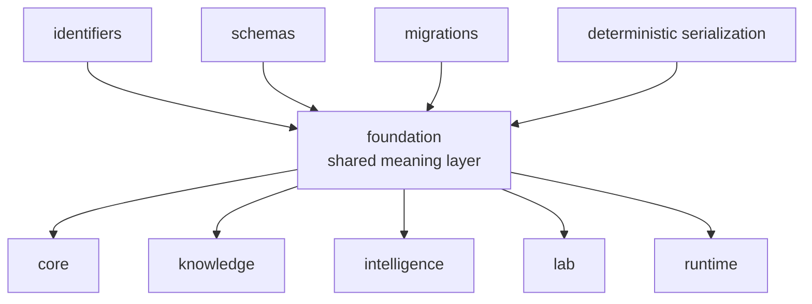

# bijux-proteomics-foundation

`bijux-proteomics-foundation` owns shared payload meaning in
`bijux-proteomics`. It keeps identifiers, schema compatibility, migrations, and
deterministic serialization stable enough that the rest of the package family
can exchange meaning without ambiguity. This is the quiet substrate of the
system. When it is right, every downstream package can speak clearly. When it
drifts, every package starts inventing its own dialect.

## What Breaks Without This Package

- two packages can talk about the same entity and still mean different things
- migrations become local hacks instead of a visible family-level discipline
- runtime, lab, and intelligence code start carrying serialization burdens that
  should have stayed below them

## What It Owns

- identifiers and shared payload primitives
- schema and serialization compatibility helpers
- migration rules for shared payload evolution

## Start With

- Open [Foundation](https://bijux.io/bijux-proteomics/03-bijux-proteomics-foundation/foundation/)
  for the package role and boundary.
- Open [Interfaces](https://bijux.io/bijux-proteomics/03-bijux-proteomics-foundation/interfaces/)
  when the question is a public contract or shared data surface.
- Open [bijux-proteomics-core](https://bijux.io/bijux-proteomics/04-bijux-proteomics-core/)
  when the concern becomes program behavior rather than shared meaning.

## What It Refuses

- program policy and lifecycle decisions
- evidence truth and contradiction state
- execution, provider, or operator-facing runtime behavior

## First Proof Check

- `packages/bijux-proteomics-foundation/src/bijux_proteomics_foundation`
- `packages/bijux-proteomics-foundation/tests`
- tracked artifacts under `apis/` when the change reaches a public contract
