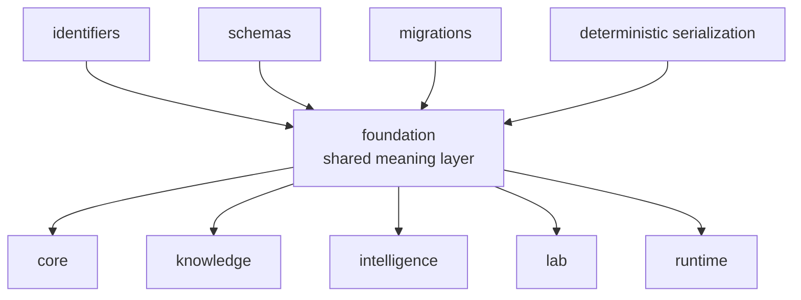

# bijux-proteomics-foundation

`bijux-proteomics-foundation` owns shared payload meaning in
`bijux-proteomics`. It keeps identifiers, schema compatibility, migrations, and
deterministic serialization stable enough that the rest of the package family
can exchange meaning without ambiguity. This is the quiet substrate of the
system. When it is right, every downstream package can speak clearly. When it
drifts, every package starts inventing its own dialect.

This package remains intentionally narrow, but it is not trivial. The current
product depth in core, runtime, knowledge, intelligence, and lab only stays
coherent because foundation keeps identifiers, compatibility, migrations,
canonical serialization, and shared document semantics stable enough for the
other owners to build on one meaning instead of five competing ones.

## What Breaks Without This Package

- two packages can talk about the same entity and still mean different things
- migrations become local hacks instead of a visible family-level discipline
- runtime, lab, and intelligence code start carrying serialization burdens that
  should have stayed below them

## What It Owns

- identifiers and shared payload primitives
- schema and serialization compatibility helpers
- migration rules for shared payload evolution

## Why This Surface Matters More Now

- more benchmark and workflow depth in core increases the cost of shared-model
  drift
- stronger runtime proof increases the cost of unstable serialization
- deeper knowledge and intelligence routes increase the cost of ambiguous
  identifiers and document meaning

## Shared Reader Routes

- Use [Product Overview](https://bijux.io/bijux-proteomics/01-bijux-proteomics/foundation/product-overview/)
  before this page when the question is still repository-wide.
- Use [Maintenance](https://bijux.io/bijux-proteomics/08-bijux-proteomics-maintain/bijux-proteomics-dev/maintenance-overview/)
  when the dispute is about safe change or release gates rather than shared
  payload meaning.

## Start Inside This Package

- Open [Foundation](https://bijux.io/bijux-proteomics/03-bijux-proteomics-foundation/foundation/)
  for the package role and boundary.
- Open [Architecture](https://bijux.io/bijux-proteomics/03-bijux-proteomics-foundation/architecture/)
  when the question is how identifiers, schemas, and migrations stay arranged.
- Open [Interfaces](https://bijux.io/bijux-proteomics/03-bijux-proteomics-foundation/interfaces/)
  when the question is a public contract or shared data surface.

## What It Refuses

- program policy and lifecycle decisions
- evidence truth and contradiction state
- execution, provider, or operator-facing runtime behavior

## Strongest Proof Route

- start at [Package Overview](https://bijux.io/bijux-proteomics/03-bijux-proteomics-foundation/foundation/package-overview/)
  for the narrow owner statement
- continue to [Foundation](https://bijux.io/bijux-proteomics/03-bijux-proteomics-foundation/foundation/)
  for boundary and invariant routes
- hand off to [bijux-proteomics-core](https://bijux.io/bijux-proteomics/04-bijux-proteomics-core/)
  once the question stops being about shared meaning

## First Proof Check

- `packages/bijux-proteomics-foundation/src/bijux_proteomics_foundation`
- `packages/bijux-proteomics-foundation/tests`
- tracked artifacts under `apis/` when the change reaches a public contract
