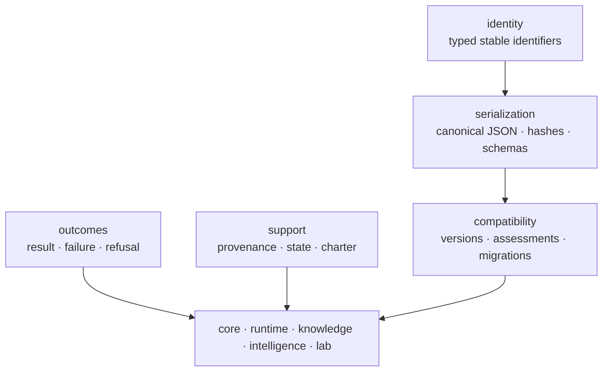

# bijux-proteomics-foundation

`bijux-proteomics-foundation` provides the small, dependency-light kernel used
to exchange durable data across Bijux Proteomics packages. It defines identity,
canonical representation, schema compatibility, and typed outcomes; it does
not define proteomics algorithms or workflow policy.

```bash
python -m pip install bijux-proteomics-foundation
```

## Contract layers



## Public kernel

The package root deliberately exports only fifteen stable primitives:

- identifiers: `AssayId`, `BatchId`, `CandidateId`, `ClaimId`, `EvidenceId`,
  `GateId`, `ProgramId`, and `TargetId`;
- document contracts: `DocumentSchema` and `JsonModel`;
- representation: `to_canonical_json` and `fingerprint_model`;
- hashing: `hash_model`, `hash_payload`, and `hash_text`.

More specialized contracts live in their owning submodules. Root exports are
lazy so importing a shared identifier does not pull unrelated implementation
into a consumer.

## Why canonical representation matters

Reproducibility requires byte-stable documents. Semantically identical payloads
must produce the same canonical JSON and fingerprint regardless of insertion
order or process. Scientific values require explicit handling; unsupported or
ambiguous values fail rather than being converted silently. A stable hash can
prove equality of canonical content, but not the scientific truth of that
content.

## Compatibility model

Versioned documents carry schema identity separately from domain data.
Compatibility assessment determines whether a consumer can read a document;
migrations perform declared transformations between supported schemas. Import
migrations handle renamed Python surfaces independently from document-schema
migrations. This distinction prevents package renames from being confused with
scientific data evolution.

## Typed outcomes

Foundation distinguishes successful results, operational failures, refusals,
and missing optional dependencies. Consumers can therefore preserve the reason
work did not produce a value instead of collapsing every condition into an
exception or empty payload.

## Boundaries

Foundation has no outbound dependency on another product package. It does not
own sequence models, spectrum processing, execution state machines, evidence
truth, ranking policy, or assay planning. A type belongs here only when all
consumers need the same meaning and that meaning remains valid without a
specific proteomics workflow.

Continue with [package overview](foundation/package-overview.md),
[public imports](interfaces/public-imports.md),
[data contracts](interfaces/data-contracts.md), or
[compatibility commitments](interfaces/compatibility-commitments.md).
