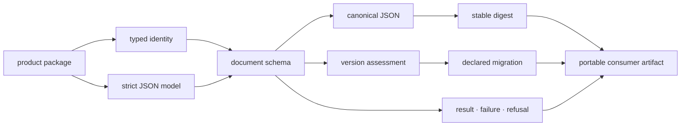
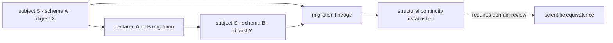
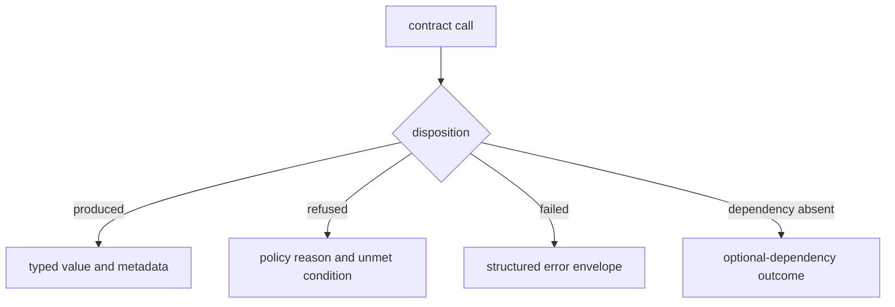
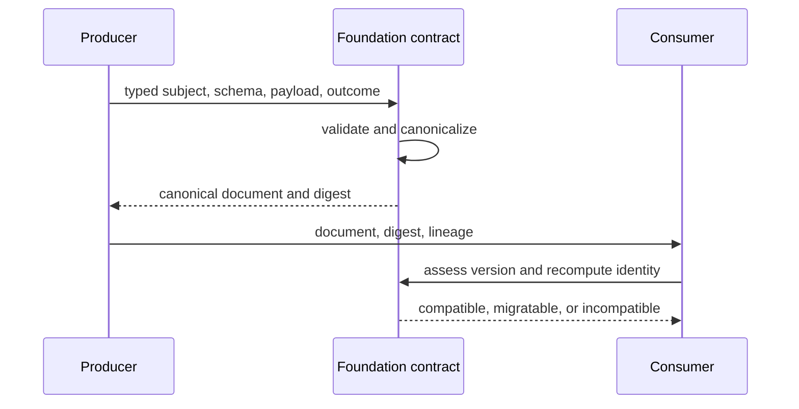
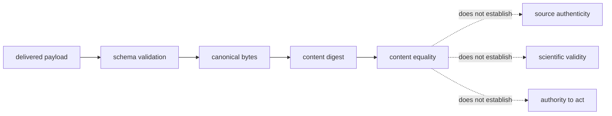

# bijux-proteomics-foundation

`bijux-proteomics-foundation` provides the small, dependency-light kernel used
to exchange durable data across Bijux Proteomics packages. It defines identity,
canonical representation, schema compatibility, and typed outcomes; it does
not define proteomics algorithms or workflow policy.

```bash
python -m pip install bijux-proteomics-foundation
```

## Contract layers



## Public kernel

The package root deliberately exports only fifteen stable primitives:

- identifiers: `AssayId`, `BatchId`, `CandidateId`, `ClaimId`, `EvidenceId`,
  `GateId`, `ProgramId`, and `TargetId`;
- document contracts: `DocumentSchema` and `JsonModel`;
- representation: `to_canonical_json` and `fingerprint_model`;
- hashing: `hash_model`, `hash_payload`, and `hash_text`.

More specialized contracts live in their owning submodules. Root exports are
lazy so importing a shared identifier does not pull unrelated implementation
into a consumer.

## Why canonical representation matters

Reproducibility requires byte-stable documents. Semantically identical payloads
must produce the same canonical JSON and fingerprint regardless of insertion
order or process. Scientific values require explicit handling; unsupported or
ambiguous values fail rather than being converted silently. A stable hash can
prove equality of canonical content, but not the scientific truth of that
content.

```python
from bijux_proteomics_foundation import hash_payload, to_canonical_json

payload = {"target": "target-mapk1", "scores": [0.91, 0.87]}
canonical = to_canonical_json(payload)
digest = hash_payload(payload)
```

`canonical` is a deterministic representation and `digest` identifies that
representation. Neither value establishes whether the target assignment or
scores are scientifically correct; that judgment remains with the producing
domain and its evidence.

## Compatibility model

Versioned documents carry schema identity separately from domain data.
Compatibility assessment determines whether a consumer can read a document;
migrations perform declared transformations between supported schemas. Import
migrations handle renamed Python surfaces independently from document-schema
migrations. This distinction prevents package renames from being confused with
scientific data evolution.

| Situation | Foundation response | Consumer obligation |
| --- | --- | --- |
| schema is directly readable | validate under the declared version | preserve schema and content identity |
| a migration path is registered | transform in the declared direction, then validate | retain lineage and migration evidence |
| version is unknown | return an explicit incompatibility | do not coerce or guess |
| import path moved | use the import-migration contract | keep document evolution separate |
| supported value cannot canonicalize | fail at serialization | define an explicit representation before persistence |

## Preserve identity across schema change

Schema evolution creates several identities that must not be collapsed into
one checksum. A migration can preserve the subject while intentionally
changing the document bytes; a matching digest can prove byte-stable content
without proving that two records describe the same biological subject.

| Identity | Stable question | Change that is allowed | Evidence that must remain |
| --- | --- | --- | --- |
| subject identifier | which assay, claim, candidate, or evidence record is this? | representation and schema may evolve | typed identifier and namespace |
| content digest | are these canonical payload bytes equal? | any semantic edit creates a new digest | hash policy and canonical payload |
| schema identity | which structural contract interprets the document? | declared version migration | source version, target version, and migration name |
| lineage identity | where did this representation come from? | new transformations append custody | parent references, producer, and transformation record |
| scientific equivalence | did the transformation preserve domain meaning? | only changes accepted by the domain owner | domain validation outside Foundation |



Foundation can establish that the declared transformation ran and the target
document validates. The package that owns the scientific record must establish
whether meaning survived that transformation.

## Typed outcomes

Foundation distinguishes successful results, operational failures, refusals,
and missing optional dependencies. Consumers can therefore preserve the reason
work did not produce a value instead of collapsing every condition into an
exception or empty payload.



## Boundaries

Foundation has no outbound dependency on another product package. It does not
own sequence models, spectrum processing, execution state machines, evidence
truth, ranking policy, or assay planning. A type belongs here only when all
consumers need the same meaning and that meaning remains valid without a
specific proteomics workflow.

## Choose the contract deliberately

| Need | Foundation contract | Do not substitute |
| --- | --- | --- |
| distinguish entities across packages | typed identifier | an unvalidated filename or display label |
| serialize a durable document | `JsonModel` and `DocumentSchema` | an arbitrary dictionary with implicit metadata |
| compare canonical content | canonical JSON and a named hash policy | object identity or default `repr` output |
| evaluate document evolution | schema assessment and declared migration | import aliasing |
| report why no value exists | typed failure or refusal | `None`, an empty collection, or a swallowed exception |
| handle an unavailable extra | optional-dependency outcome | unconditional heavyweight imports |

## Audit a portable record

A record is portable only when an independent consumer can verify its identity
and disposition without importing the producer's internal implementation.
Review the envelope in this order:

| Check | Evidence required | Refuse when |
| --- | --- | --- |
| subject | a typed identifier with the expected namespace and syntax | identity is inferred from a filename, label, or directory |
| schema | document name, declared version, and successful strict validation | the version is missing, unknown, or silently coerced |
| content | canonical bytes and the named digest policy | the digest cannot be reproduced from the delivered payload |
| lineage | producer identity, parent references, and any migration record | a transformation has no declared source or direction |
| disposition | a typed success, refusal, failure, or dependency outcome | missing data is represented as an apparently successful empty value |



The consumer may trust a matching digest as evidence of content equality. It
must obtain scientific authority, source authenticity, and acceptance policy
from the package that owns the domain record.

## Shared Reader Routes

### Know what identity can prove

Foundation answers whether two delivered records have the same canonical
content under a declared contract. Other authorities are required for source
authenticity, scientific validity, execution fidelity, and permission to act.

| Observation | Supported conclusion | Required authority for a stronger conclusion |
| --- | --- | --- |
| canonical bytes match | payload representation is equal under the canonicalization policy | producer evidence for authenticity |
| digest matches | delivered canonical content has the expected identity | custody evidence for who produced or transported it |
| schema validates | document conforms to the declared structural contract | domain owner for semantic correctness |
| migration succeeds | transformed document satisfies the target schema and declared migration | domain evidence that the transformation preserved scientific meaning |
| typed outcome is `produced` | the operation returned a value under its contract | Core or another product owner for acceptance |
| typed outcome is `refused` | the owner declined work for a recorded reason | owner policy and inputs for whether retry is appropriate |



Use [cross-package ownership](../01-bijux-proteomics/foundation/cross-package-ownership.md)
to find the semantic owner, [Runtime](../09-bijux-proteomics-runtime/index.md)
for execution and artifact custody, and
[Maintenance](../08-bijux-proteomics-maintain/index.md) for contract-change
governance.

## Start Inside

| Need | Read next |
| --- | --- |
| establish ownership and non-goals | [package overview](foundation/package-overview.md) |
| choose a supported Python route | [public imports](interfaces/public-imports.md) |
| define identifiers and document models | [data contracts](interfaces/data-contracts.md) |
| persist or exchange an artifact | [artifact contracts](interfaces/artifact-contracts.md) |
| assess a version or migration | [compatibility commitments](interfaces/compatibility-commitments.md) |
| review invariants and known limits | [quality](quality/index.md) |
