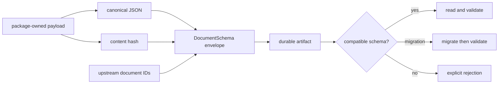

# Artifact Contracts

Foundation defines the envelope that lets a durable document identify its
schema, producer, lifecycle state, lineage, revision, and content. Product
packages own the payload meaning; Runtime owns execution artifacts; Knowledge
owns evidence custody.

## Document Envelope

| Field group | Fields | Contract |
| --- | --- | --- |
| schema identity | `schema_version`, `document_kind` | selects the reader and compatibility policy |
| producer identity | `created_by`, `source_system`, `package_name`, `package_version` | states who emitted the document |
| durable identity | `document_id`, `content_hash` | distinguishes record identity from content identity |
| lifecycle | `status`, `revision`, `created_at`, `updated_at`, `updated_by` | preserves governed evolution |
| lineage | `derived_from`, `parent_document_id`, `trace_id`, `parent_trace_id` | connects derivation and cross-system tracing |
| indexing | `tags` | supports discovery without changing payload semantics |

`extra="forbid"` prevents undeclared envelope fields from being silently
accepted. Schema versions are normalized during validation. `touch()` returns
a revised copy with updated audit metadata; it does not mutate the original.

## Identity And Stability

- A document ID identifies a durable record across revisions.
- A content hash identifies canonical payload content under the active hash
  policy.
- A revision records lifecycle movement; it is not a schema version.
- Canonical JSON stabilizes key ordering and supported value representation.
- Equal hashes establish equal canonical payload bytes under one policy, not
  scientific equivalence, authenticity, or completeness.

## Evolution Contract

Persisted artifacts require an explicit disposition when schemas change:

| Change | Required action |
| --- | --- |
| compatible additive field | document default and test old/new readers |
| semantic change to an existing field | issue a schema version and migration or rejection |
| renamed or removed field | provide ordered migration steps and consumer evidence |
| unknown source version | reject; do not infer compatibility |
| deprecated target version | refuse migration to that target |
| migration produces wrong version | raise a migration execution error |

`MigrationRegistry` resolves a linear declared path and detects missing steps
and cycles. A successful migration must still pass target-schema validation and
preserve the provenance needed to explain the transformation.

## Review An Artifact Change

Inspect the authoritative payload model, envelope diff, canonical bytes, hash,
old and new fixtures, migration path, and downstream readers together. A
round-trip test proves serialization stability; it does not prove that a
changed payload retains the same scientific meaning.
