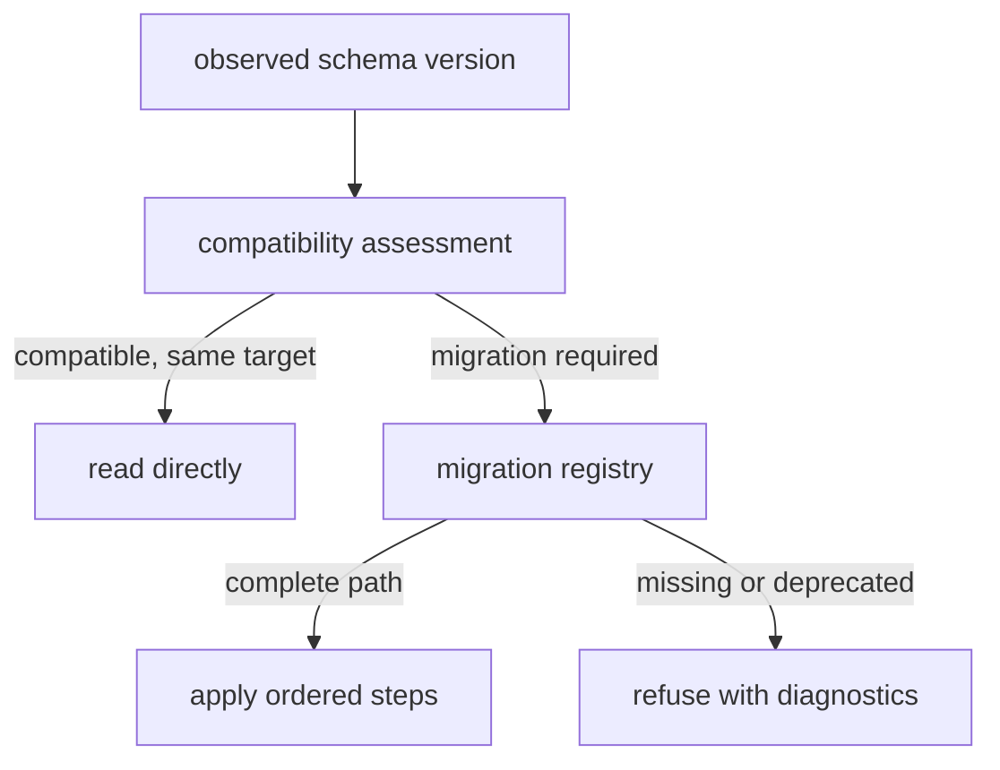

# Compatibility commitments

Foundation compatibility covers three independent surfaces: Python imports,
validated model shapes, and persisted document versions. A change can be safe
on one surface and breaking on another, so each is reviewed separately.

## Python imports

The fifteen curated package-root exports are the smallest stable import
contract. Documented submodules provide specialized types and helpers.
Underscore-prefixed modules and symbols are internal, even when a compatibility
adapter temporarily reaches them.

Import migrations declare a canonical target, emit a deprecation message, and
preserve `getattr`, `dir`, and named export behavior long enough for callers to
move. A forwarding path is not permission to add new behavior to the old name.

## Model evolution

Foundation models use validation to reject ambiguous values and, for durable
envelopes and migration models, unknown fields. Adding an optional field can be
compatible when its absence has a stable meaning. Removing or renaming a field,
changing an accepted type, tightening validation, changing defaults, or
altering serialization order requires explicit compatibility review.

Typed identifiers carry syntactic constraints, while prefixed identifiers add
runtime classification. Changing either constraint can reject previously
persisted data and is therefore a contract change.

## Document evolution

Within one major version, a consumer can read an equal or newer observed minor
version under the additive compatibility rule. An older observed minor does
not satisfy a newer expected contract without migration. Major-version changes
require coordinated evolution. Patch changes do not by themselves change the
compatibility class.

The migration registry requires a complete sequence of declared edges and
checks the version emitted after every step. Missing paths, cycles, deprecated
targets, and incorrect step output fail explicitly.

## Representation stability

Canonical JSON, stable JSON, JSONL, flattened TSV, and fingerprints each have
defined purposes. Only canonical content under a declared hash policy should
be used for durable equality checks. Human-readable formatting may evolve
without changing canonical identity only when the underlying normalized
payload remains the same.

## What is not promised

- Scientific equivalence between documents with equal structure.
- Permanent support for private helpers or compatibility-only imports.
- Automatic migration when no registry was supplied.
- Compatibility with unknown major versions.
- Authentication or provenance trust from a content hash alone.
- A guarantee that downstream packages preserve foundation compatibility when
  they add stricter domain rules.

Consumers should pin supported schema ranges, test round trips and migration
paths with representative persisted documents, and retain the original input
when a migration produces a new artifact.
