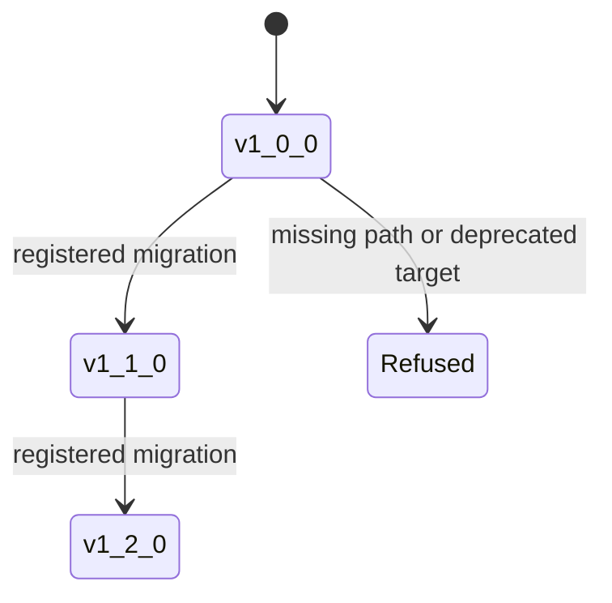

# Contract configuration

Foundation has no global configuration file, environment-variable namespace,
CLI, or service settings. Its behavior is configured through explicit model
fields and policy objects passed by the caller. This keeps serialization and
compatibility decisions visible in the artifact that depends on them.

## Schema versions

Schema versions use numeric `major.minor.patch` form. Values such as `1.2`,
`v1.2.0`, prerelease strings, or non-numeric components are rejected rather
than normalized heuristically.

Compatibility uses these rules:

- a different major version is backward-incompatible;
- an observed minor version older than the expected minor is
  forward-incompatible;
- the same major version with an equal or newer observed minor is compatible;
- patch differences do not change this compatibility classification.

Compatibility answers whether a document satisfies an expected reading
contract. Migration is a separate decision.

## Migration registry

`MigrationRegistry` stores directed `SchemaMigration` steps keyed by source
version. Each step declares its source, target, description, and migration
function. The registry:

- resolves an ordered path to a target version;
- detects missing steps and cycles;
- reports registered versions;
- marks unusable target versions as deprecated;
- verifies that each migration emits the version it promised.

`assess_schema_evolution()` combines compatibility and registry state into a
`SchemaEvolutionAssessment`: observed and target versions, compatibility,
whether migration is required and available, whether the target is deprecated,
and diagnostic notes.

## Hashing policy

`StableHashPolicy` names the algorithm and JSON separators used for persistent
fingerprints. The default policy is `scientific-object-sha256-v1` with SHA-256
and compact canonical JSON separators. A non-default policy should be stored or
otherwise recoverable with the artifact; a digest without its policy is an
incomplete interoperability contract.

## Configuration rules for consumers

1. Store the schema version with the document, not only in application code.
2. Assess compatibility before deserializing into a newer contract.
3. Register migrations explicitly and test every adjacent edge and complete
   supported path.
4. Never migrate to a deprecated target or skip an unregistered version edge.
5. Keep hashing policy stable for the lifetime of fingerprints used as durable
   identifiers.
6. Treat package configuration, runtime configuration, and scientific policy as
   downstream concerns; foundation does not load them implicitly.

This explicit model prevents local environment state from changing the meaning
of a shared document silently.
