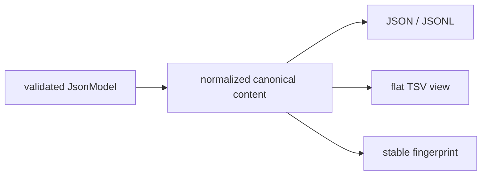
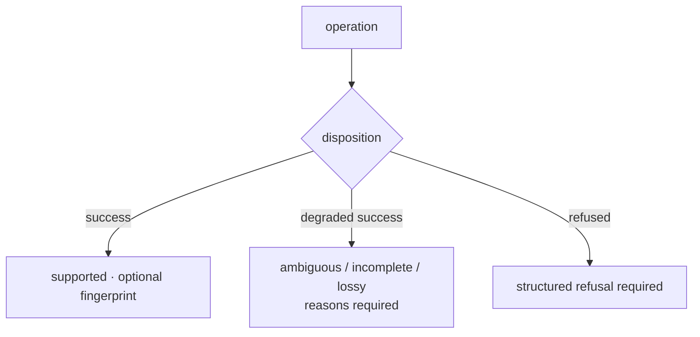

# Foundation data contracts

Foundation defines the values that must retain one meaning across package and
process boundaries: typed identifiers, durable document metadata,
JSON-compatible models, deterministic representation, version assessment, and
explicit outcomes.

## Identity

Identifiers are constrained strings: whitespace is stripped, values contain
1–128 lowercase alphanumeric or `._:-` characters, and the first character is
alphanumeric. Type aliases distinguish programs, targets, candidates, proteins,
peptides, spectra, modifications, experiments, runs, assays, evidence, claims,
reviews, batches, gates, studies, PTMs, and lab actions.

For persisted cross-system identifiers, use the prefixed builder:

```python
from bijux_proteomics_foundation.identity.identifiers import (
    IdentifierKind,
    build_identifier,
    ensure_identifier_kind,
)

run_id = build_identifier(IdentifierKind.RUN, "cohort-a-17")
ensure_identifier_kind(run_id, IdentifierKind.RUN)
```

The prefix makes an identifier classifiable outside Python's static type
system. It does not guarantee that the referenced entity exists.

## Document envelope

`DocumentSchema` attaches lifecycle and provenance metadata to a long-lived
payload:

- semantic `schema_version` and producing `created_by` identity;
- source system, document ID and kind, package name and version;
- status, revision, timestamps, and updating actor;
- parent and derived-from document lineage;
- trace and parent-trace identifiers;
- tags and an optional canonical content hash.

Unknown envelope fields are rejected. `touch()` returns a new revision with
updated audit metadata; `with_content_hash()` returns a copy containing a
deterministic payload hash. Neither method mutates the original model.

## Portable models

`JsonModel` is the shared Pydantic base for cross-package records. It supports:

| Method | Representation |
| --- | --- |
| `to_dict()` | normalized JSON-compatible mapping |
| `to_json()` | readable indented JSON |
| `to_stable_json()` | sorted JSON for reproducible diffs |
| `to_jsonl_line()` | one deterministic JSON Lines record |
| `to_flat_dict()` / `to_tsv_row()` | flattened review-table view |
| `content_fingerprint()` | SHA-256 identity of canonical model content |
| `from_dict()` / `from_json()` | validated reconstruction |

File helpers persist JSON, stable JSON, JSONL, or a single TSV row. Consumers
must treat the typed model as canonical; alternate renderings are views.



## Determinism boundary

Canonicalization orders mappings and stable collection values before hashing.
Equivalent key order therefore produces the same digest. A digest proves byte
identity under a named hashing policy; it does not prove provenance,
authenticity, biological correctness, or semantic equivalence between
different schemas.

## Schema Evolution Assessment

Compatibility assessment records the observed and target versions, their
relationship, whether a migration is required, whether a registered path is
available, whether the target is deprecated, and the reasons for the verdict.

| Condition | Classification | Required caller response |
| --- | --- | --- |
| same compatible contract | compatible | validate without migration |
| compatible versions with a declared path | compatible, migration required | migrate a copy and validate the target |
| different major versions | backward incompatible | coordinate the contract change; do not coerce |
| observed contract cannot satisfy the target | forward incompatible | stop or select an explicitly supported target |
| target deprecated or migration absent | migration unavailable | preserve the source and return a visible refusal |

## Operation Outcomes

`OperationResult` keeps transport success separate from support quality. A
successful result must use the supported state. A degraded result must carry
stable reasons and use an ambiguous, incomplete, or lossy state. A refused
result must carry a structured `OperationRefusal`. Provenance pointers and an
output fingerprint can accompany the dispositions that produced output.



Consumers must branch on disposition and support state. Treating every
serialized result as success discards the contract that protects downstream
scientific and operational decisions.

For version behavior, continue with
[compatibility commitments](compatibility-commitments.md). For public imports,
see [Python API surface](api-surface.md).
