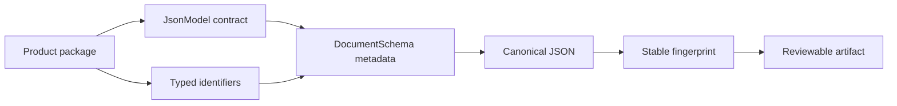

# Interfaces

Foundation supplies the identifiers, document metadata, deterministic
serialization, and outcome vocabulary shared by the package family. These are
small interfaces with a large compatibility radius: a change to identifier
syntax or canonical JSON can alter persisted artifacts produced by every
downstream package.



## Choose the interface by responsibility

| Need | Interface | Contract boundary |
| --- | --- | --- |
| refer to a program, claim, evidence item, assay, or batch | typed identifiers | constrained strings and recognized prefixes; not entity resolution |
| define a JSON-backed domain object | `JsonModel` | validation and deterministic representations; not scientific correctness |
| attach lifecycle and lineage metadata | `DocumentSchema` | producer, version, revision, ancestry, and content hash |
| compare payload identity across runs | canonical JSON and stable hashing | deterministic representation; not semantic equivalence |
| communicate refusal or failure | outcome modules | explicit non-success vocabulary; not recovery policy |
| evolve stored documents | compatibility modules | version assessment and migration; not silent schema coercion |

## Supported entry routes

Use package-root imports for the deliberately narrow shared primitives:

```python
from bijux_proteomics_foundation import DocumentSchema, JsonModel, hash_payload
```

Use documented submodules when the contract is intentionally broader than the
root facade, such as identifier construction, schema migration, refusal
records, or provenance state. The [Python API surface](api-surface.md) names
those ownership boundaries; [Public imports](public-imports.md) distinguishes
stable root names from explicit submodule use.

Foundation has no command-line or network service surface. Runtime owns process
execution and HTTP behavior. Product packages own biological interpretation,
decision policy, evidence reconciliation, and laboratory consequences.

## Contract reading order

1. Start with [Data contracts](data-contracts.md) for identifier and model
   semantics.
2. Read [Artifact contracts](artifact-contracts.md) before persisting or
   comparing documents.
3. Use [Compatibility commitments](compatibility-commitments.md) before
   changing a schema version or import path.
4. Consult [Configuration surface](configuration-surface.md) to confirm that a
   behavior is code-owned rather than environment-controlled.
5. Use [Operator workflows](operator-workflows.md) for inspection and migration
   procedures.

## Trust boundaries

A valid model can still contain weak evidence. A stable hash proves that two
canonical byte representations match; it does not prove provenance,
authenticity, or biological equivalence. A migrated document can satisfy the
new schema while still requiring scientific review. Downstream packages must
preserve those distinctions rather than converting technical validity into a
scientific claim.

## Source of truth

The package root defines the curated import facade. Contract implementations
live under `identity`, `serialization`, `compatibility`, and `outcomes` in
`packages/bijux-proteomics-foundation/src/bijux_proteomics_foundation/`.
Package tests and the public API ledger verify that the documented facade does
not drift from the installed distribution.
