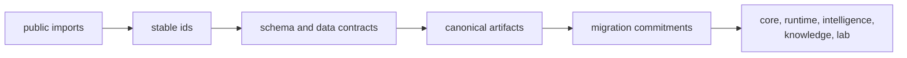

# Interfaces

`bijux-proteomics-foundation` interfaces are the points where shared meaning
leaves this small package and becomes everybody else's assumption. This section
should help a reader see how identifiers, schema profiles, canonical
serialization, and migrations become stable promises that the rest of the
repository can safely build on.

## What These Interfaces Actually Do

- they give every other package a shared language for document identity and
  payload shape
- they make persisted artifacts comparable across versions instead of merely
  serializable once
- they publish small surfaces, but those surfaces carry repository-wide
  consequences when they change

## Start With

- open [Data Contracts](https://bijux.io/bijux-proteomics/03-bijux-proteomics-foundation/interfaces/data-contracts/)
  when the question is really about what a payload means and how long that
  meaning must survive
- open [Artifact Contracts](https://bijux.io/bijux-proteomics/03-bijux-proteomics-foundation/interfaces/artifact-contracts/)
  when the concern is canonical JSON, fingerprints, or persisted record form
- open [Compatibility Commitments](https://bijux.io/bijux-proteomics/03-bijux-proteomics-foundation/interfaces/compatibility-commitments/)
  before changing any outward promise that downstream packages rely on
- open [Public Imports](https://bijux.io/bijux-proteomics/03-bijux-proteomics-foundation/interfaces/public-imports/)
  when the question starts from Python code rather than from artifacts

## Read By Surface

- [Public Imports](https://bijux.io/bijux-proteomics/03-bijux-proteomics-foundation/interfaces/public-imports/)
  for the narrow code surface this package intentionally exports
- [Data Contracts](https://bijux.io/bijux-proteomics/03-bijux-proteomics-foundation/interfaces/data-contracts/)
  and [Artifact Contracts](https://bijux.io/bijux-proteomics/03-bijux-proteomics-foundation/interfaces/artifact-contracts/)
  for the two surfaces that most directly preserve shared meaning
- [Entrypoints and Examples](https://bijux.io/bijux-proteomics/03-bijux-proteomics-foundation/interfaces/entrypoints-and-examples/)
  and [Operator Workflows](https://bijux.io/bijux-proteomics/03-bijux-proteomics-foundation/interfaces/operator-workflows/)
  for how maintainers touch those primitives in practice
- [API Surface](https://bijux.io/bijux-proteomics/03-bijux-proteomics-foundation/interfaces/api-surface/),
  [CLI Surface](https://bijux.io/bijux-proteomics/03-bijux-proteomics-foundation/interfaces/cli-surface/),
  and [Configuration Surface](https://bijux.io/bijux-proteomics/03-bijux-proteomics-foundation/interfaces/configuration-surface/)
  mainly as repository integration seams rather than end-user product surfaces

## What A Reader Should Walk Away Knowing

- why such a small package still has some of the highest-leverage public
  contracts in the repository
- which promises belong to payload stability versus operational convenience
- where to look first before assuming another package owns a serialization or
  migration concern

## First Proof Check

- `src/bijux_proteomics_foundation/identity/identifiers.py` and `serialization/document_schema.py`
- `src/bijux_proteomics_foundation/serialization/` and `compatibility/schema_migrations.py`
- `packages/bijux-proteomics-foundation/tests`
