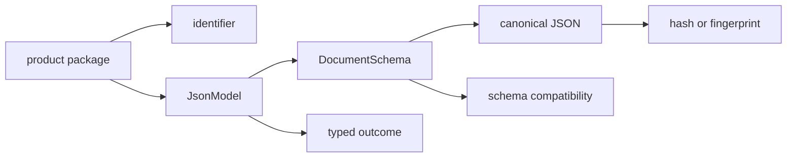
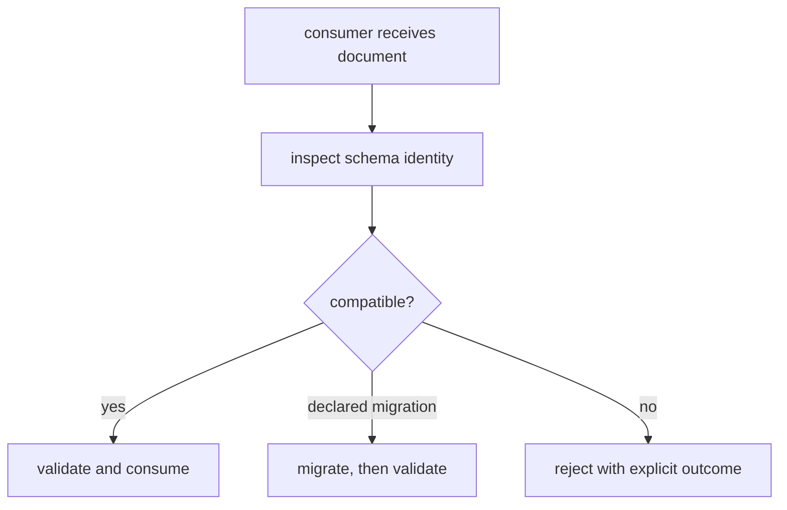

# Shared contract interfaces

Foundation interfaces are deliberately small because their compatibility radius
is large. Every product package can persist identifiers, models, hashes,
outcomes, and schema metadata. A change at this layer can therefore alter
artifacts and consumers across the repository.



## Curated root interface

The package root exposes fifteen primitives:

| Group | Exports |
| --- | --- |
| identifiers | `ProgramId`, `TargetId`, `CandidateId`, `EvidenceId`, `ClaimId`, `AssayId`, `BatchId`, `GateId` |
| models and metadata | `JsonModel`, `DocumentSchema` |
| canonical representation | `to_canonical_json`, `fingerprint_model` |
| hashing | `hash_model`, `hash_payload`, `hash_text` |

```python
from bijux_proteomics_foundation import hash_payload, to_canonical_json

payload = {"assay": "assay-mapk1", "replicates": 3}
canonical = to_canonical_json(payload)
digest = hash_payload(payload)
```

`canonical` is a deterministic representation and `digest` identifies the
canonical content under the default hash policy. Neither proves that the assay
exists, the replicates are sufficient, or the payload is authentic.

[API surface](api-surface.md) defines the curated facade and
[public imports](public-imports.md) maps specialized owner modules.

## Typed identifiers

Foundation identifiers are constrained strings used by type checkers and model
validation. Owner modules additionally expose identifier kinds, construction,
classification, and prefix validation. They do not query databases, merge
aliases, or decide whether two scientific entities are equivalent.

Use an identifier to preserve entity class across package boundaries. Use
Knowledge grounding to resolve biological identity.

## Document and serialization contracts

`JsonModel` provides the strict JSON-backed model boundary. `DocumentSchema`
carries producer, version, lineage, revision, status, timestamps, and optional
content identity for durable documents. Canonical serialization and stable
hashing operate on supported values with deterministic ordering.

[Data contracts](data-contracts.md) defines model semantics and
[artifact contracts](artifact-contracts.md) explains persisted documents,
fingerprints, and round trips.

## Typed outcomes

Specialized outcome modules expose:

- `OperationResult` and `OperationDisposition` for portable success and
  non-success state;
- `OperationRefusal` and `RefusalKind` for policy-bounded refusal;
- `ErrorEnvelope` and `ErrorCategory` for structured failures;
- explicit contract, migration, conflict, and optional-dependency exceptions.

These outcomes preserve why no value was produced. Consumers must not flatten a
refusal, unavailable extra, invalid input, and execution failure into `None` or
an empty collection.

## Compatibility interfaces

Schema versions and evolution assessments determine whether a consumer can read
a document. `MigrationRegistry` and `SchemaMigration` own declared document
transformations. Import-migration helpers support compatible Python forwarding
without changing document semantics.



[Compatibility commitments](compatibility-commitments.md) defines version and
migration guarantees. Unknown versions never become compatible by omission.

## Configuration and service boundary

Foundation has no CLI or network service. Canonicalization, validation, and
compatibility behavior are code-owned contracts rather than environment-driven
policy. [Configuration surface](configuration-surface.md) lists the narrow
supported controls. Runtime owns services and process execution; product
packages own scientific, evidential, decision, and laboratory policy.

[Operator workflows](operator-workflows.md) provides inspection, fingerprint,
compatibility, and migration sequences. [Entrypoints and examples](entrypoints-and-examples.md)
provides focused Python examples.
