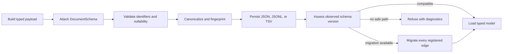

# Contract operator workflow

Foundation contracts sit at interchange boundaries: between packages, between
versions, and between a live process and a durable artifact. The safe workflow
keeps identity, schema, lineage, and hashing decisions together instead of
serializing an unversioned dictionary and reconstructing its meaning later.

## Publish a durable document

1. Construct domain values with typed identifiers and explicit scientific
   value contracts. Do not use an empty string or sentinel number to represent
   unavailable evidence.
2. Attach `DocumentSchema` with the producer, document kind, package version,
   lifecycle status, and upstream identifiers in `derived_from`.
3. Use `with_content_hash()` for the governed payload and preserve the hash
   policy wherever fingerprints cross system boundaries.
4. Serialize through `JsonModel`. `to_stable_json()` is appropriate for
   reproducible diffs; JSONL and TSV helpers provide deterministic record and
   column ordering for tabular exchange.
5. Persist the schema metadata beside the content. A filename or database
   table version is not a substitute for the document's own version.

## Read an older document

1. Parse the embedded schema version before constructing the current domain
   model.
2. Call `assess_schema_evolution()` with the observed version, target version,
   and the registry available to the consumer.
3. Load directly only when the compatibility result permits it. If migration
   is required, resolve the complete ordered path before changing the payload.
4. Apply `MigrationRegistry.migrate_to()`. Each registered function must emit
   exactly its declared target version; missing edges, cycles, and deprecated
   targets stop the operation.
5. Validate the migrated payload as the current typed model, recompute its
   content fingerprint, and preserve the source document identifier in its
   lineage.

## Review decisions that require evidence

- An identifier prefix change affects cross-package joins, not only formatting.
- A hash-policy change invalidates equality claims based on earlier digests.
- A schema field removal or semantic reinterpretation requires a version and a
  migration path; accepting old JSON is not proof of semantic compatibility.
- `touch()` increments document revision and records an actor, but it does not
  itself validate the scientific payload.

See [Contract configuration](configuration-surface.md) for version and hashing
rules and [Artifact contracts](artifact-contracts.md) for the durable envelope.
