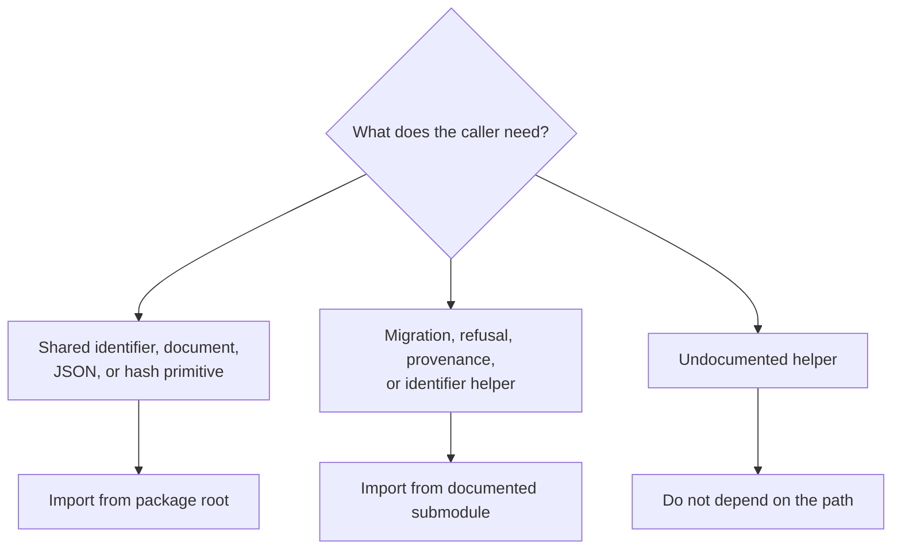

# Public imports

Import path choice communicates how much compatibility a consumer expects.
Foundation offers a compact package-root facade for ubiquitous primitives and
documented submodules for specialized contracts. Files beginning with an
underscore and implementation paths omitted from the public API ledger are not
consumer interfaces.



## Prefer the root facade

```python
from bijux_proteomics_foundation import DocumentSchema, hash_payload
```

This route is appropriate when a name appears in the package root's
`__all__`. It gives the package freedom to reorganize implementation files
without forcing consumer changes.

## Use explicit modules for specialized contracts

```python
from bijux_proteomics_foundation.identity.identifiers import (
    IdentifierKind,
    build_identifier,
    ensure_identifier_kind,
)
from bijux_proteomics_foundation.outcomes.refusals import OperationRefusal
```

Explicit module imports are appropriate when the module itself owns a
documented domain contract. They are especially useful for the wider typed-ID
vocabulary, compatibility assessments, migrations, structured outcomes, and
provenance helpers that would make the root facade too broad.

## Avoid layout-dependent imports

Do not import `_package_aliases`, rely on a module only because it appears in a
source checkout, or reach through one public module to retrieve a name owned by
another. These paths couple callers to repository layout rather than to an
intentional interface.

The installed package is the authority. A source path that is absent from the
built wheel is unavailable to consumers even if local tooling can discover it.

## Compatibility implications

| Change | Consumer impact |
| --- | --- |
| add a root export | additive public API growth |
| remove or rename a root export | breaking unless a compatibility route is maintained |
| move a documented module | requires an import-migration decision |
| change identifier or serialization semantics | may break persisted data without changing an import statement |
| reorganize undocumented internals | no public compatibility promise |

Before adopting a submodule path, verify it in the [Python API surface](api-surface.md)
and [Compatibility commitments](compatibility-commitments.md). Before changing
one, inspect downstream imports across core, runtime, intelligence, knowledge,
and lab; foundation's dependency position makes seemingly local import changes
repository-wide events.
