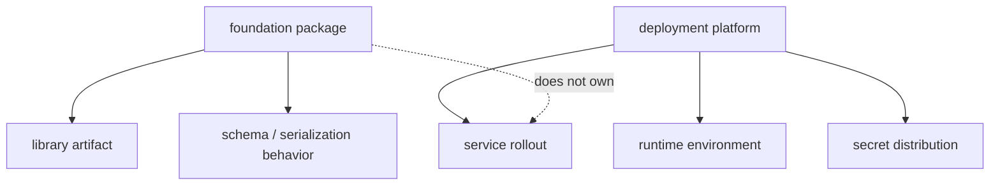

# Deployment Boundaries

Deployment for `bijux-proteomics-foundation` should respect the package boundary instead of assuming the full repository is always present.

The point of this page is to protect the idea that packages are publishable
units. Even inside a monorepo, deployment assumptions should stay narrow enough
that the package can still be understood and operated as its own surface.

Treat the operations pages for `bijux-proteomics-foundation` as the package's explicit operating memory. They should make common tasks repeatable without relearning the workflow from logs or oral history.

## Visual Summary

## Boundary Facts

- package root: `packages/bijux-proteomics-foundation`
- public metadata: `packages/bijux-proteomics-foundation/pyproject.toml`
- release notes: `packages/bijux-proteomics-foundation/CHANGELOG.md` when present

## Concrete Anchors

- `packages/bijux-proteomics-foundation/pyproject.toml` for package metadata
- `packages/bijux-proteomics-foundation/README.md` for local package framing
- `packages/bijux-proteomics-foundation/tests` for executable operational backstops

## Use This Page When

- you are installing, running, diagnosing, or releasing the package
- you need repeatable operational anchors rather than architectural framing
- you are responding to package behavior in local work, CI, or incident pressure

## Decision Rule

Use `Deployment Boundaries` to decide whether a maintainer can repeat the package workflow from checked-in assets instead of memory. If a step works only because someone already knows the trick, the workflow is not documented clearly enough yet.

## What This Page Answers

- how `bijux-proteomics-foundation` is installed, run, diagnosed, and released in practice
- which checked-in files and tests anchor the operational story
- where a maintainer should look first when the package behaves differently

## Reviewer Lens

- verify that setup, workflow, and release statements still match package metadata and current commands
- check that operational guidance still points at real diagnostics and validation paths
- confirm that maintainer advice still works under current local and CI expectations

## Honesty Boundary

This page explains how `bijux-proteomics-foundation` is expected to be operated, but it does not replace package metadata, actual runtime behavior, or validation in a real environment. A workflow is only trustworthy if a maintainer can still repeat it from the checked-in assets named here.

## Next Checks

- move to interfaces when the operational path depends on a specific surface contract
- move to quality when the question becomes whether the workflow is sufficiently proven
- move back to architecture when operational complexity suggests a structural problem

## Purpose

This page reminds maintainers that packages are publishable units, not just folders in one repo.

## Stability

Keep it aligned with the package's actual distributable surface.
