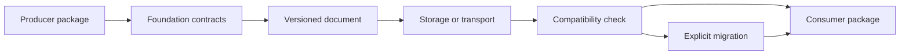

# Deployment Boundaries

Foundation is distributed with applications and services; it is not deployed as an application or service of its own. Its operational boundary is the versioned Python dependency and the serialized contracts that cross process, storage, and package boundaries.

## What ships with a consumer

The consuming environment carries Foundation for model validation, identifiers, canonical serialization, hashing, compatibility assessment, and shared outcome types. The consumer still owns its process model, network endpoints, credentials, queues, persistence strategy, observability, and scientific interpretation.

There is therefore no Foundation daemon, database, HTTP API, worker pool, or deployment manifest. Adding one would turn a dependency kernel into a second owner for concerns that belong to Runtime or the application using the contract.

## Cross-boundary contract

When a Foundation-backed document leaves one process, preserve:

- document kind, package name, package version, schema version, and creator identity;
- canonical payload representation when byte-stable comparison matters;
- the named fingerprint policy and digest when identity is asserted;
- provenance pointers needed to reopen the source context;
- explicit compatibility or migration outcomes at the receiving boundary.

A fingerprint detects payload identity under a declared serialization policy. It is not a signature and does not authenticate an untrusted document. Use infrastructure security controls for transport integrity, access control, and secret handling.

## Version rollout

Treat a Foundation upgrade as a contract rollout across producers and consumers:

1. inventory persisted schemas and root imports in each consumer;
2. run compatibility assessment before accepting a new artifact shape;
3. add and test every required migration edge;
4. deploy readers that understand the new shape before producers emit it;
5. retain old fixtures to prove backward-reading behavior;
6. advance the producing package only after the consumer set is ready.

Pinning one application is not enough when another package writes artifacts it later consumes. Release-family alignment and schema compatibility are separate controls; both must be evaluated.

## Failure ownership

A validation, canonicalization, or migration failure belongs to Foundation only when the shared contract is wrong. Missing scientific fields belong to the domain producer. Storage corruption, retry, and transport failure belong to Runtime or infrastructure. Keeping that diagnosis explicit prevents a shared schema error from being masked by deployment retries.
