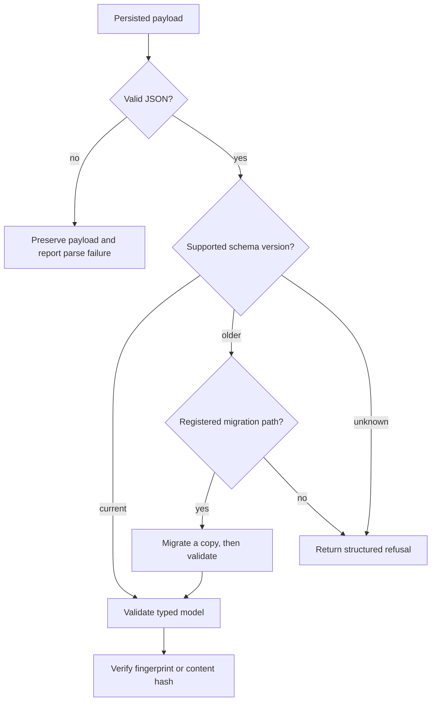

# Failure Recovery

Foundation failures are contract failures: a payload cannot be validated, a
schema version cannot be interpreted, a migration path is incomplete, or a
serialized value no longer has the expected identity. Recovery must restore a
known contract without weakening the boundary for every consuming package.

## Classify before changing data

Keep the original bytes and record the expected model and schema version. A
JSON parsing error, strict model-validation error, missing migration path,
migration execution error, and fingerprint mismatch are different conditions;
they should not be collapsed into “bad input.” Use the typed foundation
exceptions or an `ErrorEnvelope` so callers receive a stable category, code,
message, recoverability flag, details, and provenance.

For an older supported schema, ask the `MigrationRegistry` for a continuous
path to the target version and migrate a copy. Validate the migrated payload as
the current model before publishing it. Never add a permissive default merely
to make one historical document load: that changes the contract for all new
documents and can hide missing scientific meaning.

## Preserve outcome semantics

When an operation cannot proceed safely, return a structured refusal with the
unsupported, unsafe, invalid-input, unavailable, or lossy reason made explicit.
Use degraded success only when a useful output exists and its limitations are
carried in warnings. A refused result must not contain a success value; a
successful result must not carry a refusal. Those invariants keep recovery
automation from treating absence as evidence.

## Verify the recovered contract

Re-serialize the model using its canonical JSON representation, reload it, and
compare the resulting model and stable fingerprint. If a document carries a
content hash, recompute it from the governed payload. Hash equality confirms
deterministic content identity only; it does not establish provenance,
authenticity, or scientific equivalence.

Recovery is complete after the current contract validates, round-trip behavior
is stable, provenance still points to the original and derived records, and
each consuming package accepts the recovered payload under its own domain
rules.
