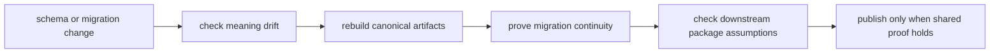

# Operations

`bijux-proteomics-foundation` operations is the discipline of changing shared
meaning without breaking the family. A maintainer here is not mostly operating a
service. They are stewarding compatibility: every schema tweak, serialization
decision, and migration rule can ripple through every other package.

## What Operations Means Here

- protecting long-lived records matters more than local implementation
  convenience
- release confidence comes from compatibility proof, not from file count
- downstream breakage often begins as subtle meaning drift rather than obvious
  runtime failure

## Start With

- open [Common Workflows](https://bijux.io/bijux-proteomics/03-bijux-proteomics-foundation/operations/common-workflows/)
  when you need the expected path from change to compatibility proof
- open [Release and Versioning](https://bijux.io/bijux-proteomics/03-bijux-proteomics-foundation/operations/release-and-versioning/)
  before treating any schema or migration edit as publishable
- open [Failure Recovery](https://bijux.io/bijux-proteomics/03-bijux-proteomics-foundation/operations/failure-recovery/)
  when persisted records or cross-package fixtures have already drifted
- open [Observability and Diagnostics](https://bijux.io/bijux-proteomics/03-bijux-proteomics-foundation/operations/observability-and-diagnostics/)
  when you need to prove whether the break is semantic, versioned, or
  serialization-specific

## Operational Reading Paths

- [Local Development](https://bijux.io/bijux-proteomics/03-bijux-proteomics-foundation/operations/local-development/)
  and [Installation and Setup](https://bijux.io/bijux-proteomics/03-bijux-proteomics-foundation/operations/installation-and-setup/)
  for working safely with canonical fixtures and migrations
- [Deployment Boundaries](https://bijux.io/bijux-proteomics/03-bijux-proteomics-foundation/operations/deployment-boundaries/)
  and [Security and Safety](https://bijux.io/bijux-proteomics/03-bijux-proteomics-foundation/operations/security-and-safety/)
  for understanding what must remain conservative because other packages depend
  on it
- [Performance and Scaling](https://bijux.io/bijux-proteomics/03-bijux-proteomics-foundation/operations/performance-and-scaling/)
  only when artifact volume or migration throughput becomes operationally
  significant, not as the default concern

## First Proof Check

- `src/bijux_proteomics_foundation/serialization/document_schema.py` and `compatibility/schema_migrations.py`
- `src/bijux_proteomics_foundation/serialization/`
- `packages/bijux-proteomics-foundation/tests`
