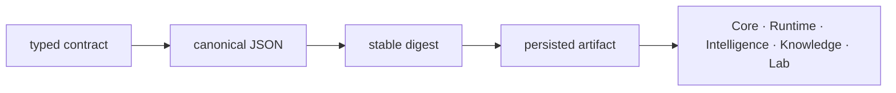

# Local development

Foundation owns the small contracts that every other Proteomics package must
interpret in the same way: canonical serialization, stable hashes, document
schemas, migrations, outcomes, identifiers, and shared validation primitives.
A local change can therefore be syntactically small and still affect persisted
artifacts across the package family.

## Run the package gates

Use the repository dispatcher so Foundation is tested with the shared toolchain
and the same dependency resolution used by the other packages.

```bash
make lint PACKAGE=bijux-proteomics-foundation
make test PACKAGE=bijux-proteomics-foundation
make quality PACKAGE=bijux-proteomics-foundation
make api PACKAGE=bijux-proteomics-foundation
```

Run `make build PACKAGE=bijux-proteomics-foundation` when public exports,
package data, or metadata changes. Outputs remain under `artifacts/`.

## Trace meaning before editing



Start at the contract owner, then follow its serialization and downstream use.
For document changes, inspect `serialization/document_schema.py`,
`serialization/scientific_values.py`, and `compatibility/schema_migrations.py`.
For result behavior, inspect `outcomes/results.py` and `outcomes/exceptions.py`.
For digests, treat canonicalization and hashing as one contract: changing either
can invalidate references even when the decoded object looks unchanged.

## Match proof to risk

| Change | Minimum proof |
| --- | --- |
| validator or field constraint | valid, boundary, and invalid examples |
| serialization order or scalar handling | byte-exact canonical JSON and digest fixtures |
| schema version | old-document load, explicit migration, and new-document round trip |
| public export | root import, type boundary, and downstream consumer import |
| outcome contract | success and failure branches retain machine-readable details |

Do not update a golden artifact merely because a test changed. First establish
whether the previous bytes represented the intended contract. A new digest is
evidence of a compatibility event, not formatting noise.

## Preserve kernel constraints

Foundation stays dependency-light and domain-neutral. It must not import Core,
Runtime, Intelligence, Knowledge, or Lab to make a consumer scenario easier.
If a proposed shared type contains scientific workflow policy, evidence
interpretation, or laboratory authority, it belongs to the package that owns
that meaning.

A Foundation change is ready when old persisted inputs have a declared result,
new outputs are deterministic, downstream packages can consume the public
contract without reverse dependencies, and any changed meaning has an explicit
migration route.
