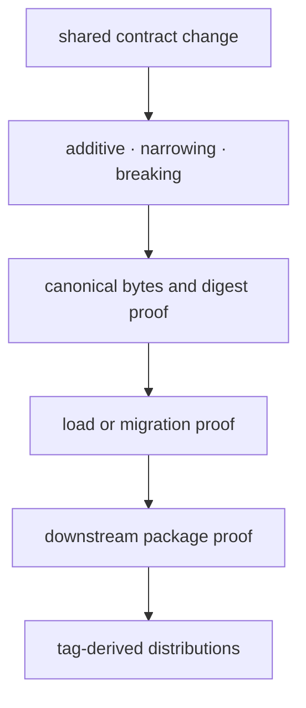

# Release and versioning

Foundation follows the coordinated package-family release identity.
The version is resolved from Git tags through `hatch-vcs`.
A `v<version>` tag identifies the source revision shared with the coordinated
package family. The fallback value in package metadata supports source archives
without repository history; it does not define a separate Foundation release.
Because Foundation contracts sit below every canonical package, release risk is
determined by semantic and byte compatibility rather than the number of files
changed.

## Classify the change

| Change | Compatibility posture |
| --- | --- |
| new optional field with a stable default | potentially additive; prove old readers and writers |
| tighter validation | narrowing; identify previously valid values that now fail |
| canonical serialization change | artifact-breaking unless byte compatibility is preserved |
| schema version increment | requires an explicit load or migration decision |
| public export removal or move | import-breaking; provide a supported migration route |
| dependency increase | package-family event; confirm the kernel remains lightweight |

Schema version and package version answer different questions. The package
version identifies a published code build. A document schema version identifies
the interpretation of persisted data. Do not increment one as a substitute for
governing the other.

## Release evidence

Before Foundation is included in a release candidate, run:

```bash
make test PACKAGE=bijux-proteomics-foundation
make quality PACKAGE=bijux-proteomics-foundation
make api PACKAGE=bijux-proteomics-foundation
make build PACKAGE=bijux-proteomics-foundation
```

The evidence set for a contract-changing release also includes canonical JSON
fixtures, stable-digest comparisons, old-document load tests, migration tests,
and representative producer/consumer round trips. API snapshots alone cannot
detect byte or meaning drift.



## Communicate consumer impact

Update `packages/bijux-proteomics-foundation/CHANGELOG.md` with the affected
contract, the old and new interpretation, persisted-data impact, and the
required consumer action. If only implementation changed, say which observable
contract remained stable. Avoid describing a validator or schema change as
routine maintenance.

The compatibility alias `proteomics-foundation` forwards the canonical public
surface and must be verified when root exports change. The alias does not own a
separate schema or release policy.

After publication, install the exact distribution into an empty environment,
import the documented root contracts, serialize a representative document, and
verify its digest and load result. Publication completes transport; the
round-trip establishes that the released kernel still honors its data promise.
