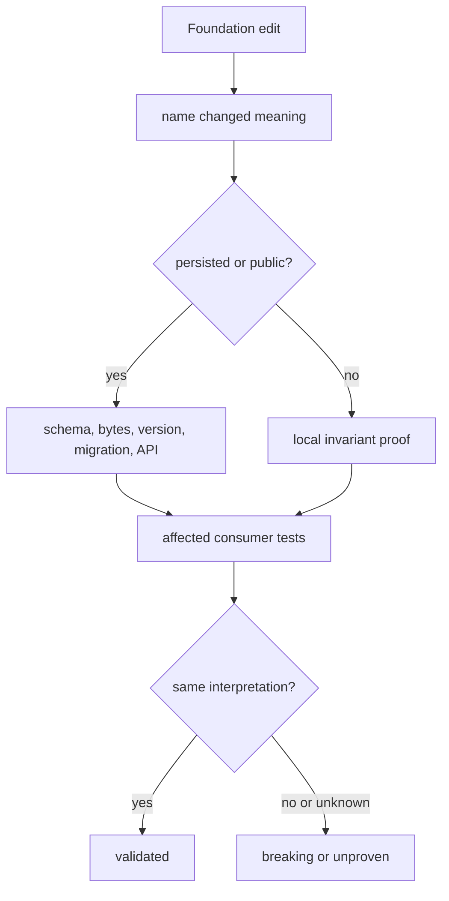

# Change validation

Validate a Foundation change across every stability dimension it touches:
semantic value, serialized bytes, schema version, migration, fingerprint,
public import, and consumer interpretation.

## Change-to-proof map

| Change | Required local proof | Required boundary proof |
| --- | --- | --- |
| identifier validation or normalization | valid/invalid table, equality, canonical form, round trip | joins, caches, and reference consumers |
| result, failure, or refusal | exhaustive constructors and serialized outcome | every consumer branch that distinguishes the outcomes |
| canonical JSON or stable value | byte fixtures, unsupported inputs, ordering, round trip | fingerprints and persisted artifact readers |
| document schema | old/new fixtures, version, validation, round trip | all packages that publish or read the document |
| migration | source and target fixtures, loss policy, unsupported path, repeat behavior | consumer opens migrated output without coercion |
| fingerprint | equal-meaning and changed-meaning cases | cache, artifact, or evidence identity consumers |
| public export | API guard, typing, import-boundary and dependency checks | direct downstream imports |

## Validation route

Inspect generated or retained fixtures before and after the change. A parser
that accepts old bytes is not compatible if the reconstructed meaning moved.
A successful migration is not safe if it drops provenance or collapses an
outcome class.

## Validation record

State the contract family, old and new meaning, stability dimensions, schema
versions, migration direction and loss policy, consumers, exact checks, and
unverified paths. If compatibility is intentionally broken, use an explicit
version and rejection path rather than silent coercion.
