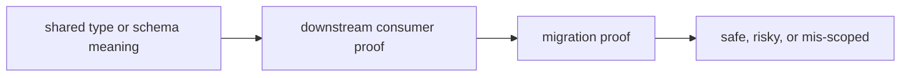

# Change Validation

Change validation should make it obvious whether a package edit is safe, risky, or mis-scoped.

## Validation Model

This page should frame validation as consumer protection. Foundation changes
are safe only when shared meaning, migrations, and downstream use still line up
without silent coercion.

## Review Rules

- validate every shared-type change against downstream consumers
- require migration proof for durable payload changes
- reject silent coercion that hides a breaking semantic shift

## First Proof Check

- `packages/bijux-proteomics-foundation/tests`
- `src/bijux_proteomics_foundation/schema.py` and `migrations.py`
- `src/bijux_proteomics_foundation/serialization.py`

## Design Pressure

Foundation validation fails when migration success is treated as enough proof on
its own. The package has to prove that durable meaning still matches what
downstream consumers believe they are reading.
