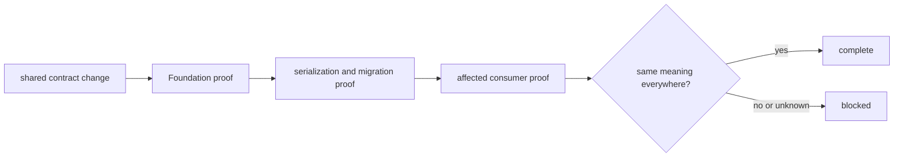

# Definition of done

A Foundation change is complete when one shared meaning remains portable across
all consumers that serialize, fingerprint, migrate, or branch on it. Passing a
local unit test is necessary; it is not cross-package compatibility evidence.

## Completion gate

| Changed contract | Required evidence | Consumer consequence to inspect |
| --- | --- | --- |
| identifier | valid and invalid construction, normalization, equality, and round trip | caches, references, and joins retain identity |
| result, failure, or refusal | exhaustive state construction and serialization | callers do not collapse refusal, failure, and absence |
| canonical JSON | byte-stable ordering and supported-value round trips | fingerprints and retained artifacts remain reproducible |
| document schema | validation, version field, and representative old/new documents | readers reject or accept the same document classes deliberately |
| schema migration | source-version fixture, target-version result, idempotence policy, and unsupported path | no consumer guesses how to cross a version boundary |
| fingerprint or stable value | deterministic fixture and semantic-change case | equal meaning hashes equally; changed meaning cannot reuse identity |
| public export | API guard and import-boundary proof | consumers have one supported import route |

## Contract travel

Start with the focused suites under `tests/identity`, `tests/outcomes`,
`tests/serialization`, and `tests/compatibility`. Public exports and dependency
direction are protected under `tests/package`. Then run the tests of every
package whose stored or public contract consumes the changed meaning.

## Completion record

Record the contract family, old and new serialized forms when applicable,
migration direction, affected consumers, and exact checks. If no prior fixture
exists, state that compatibility is unproven; do not infer it from successful
construction of the new type.

## Not complete

The change remains incomplete if two versions can be read but their semantic
difference is undocumented, if a migration mutates provenance silently, if a
new export bypasses the public API, or if downstream packages are expected to
adapt through duck typing. Shared meaning must move by an explicit contract.
