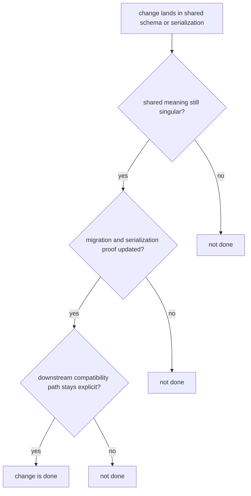

# Definition of Done

Done means the package is easier to trust after the change, not just that the diff merged.

For `bijux-proteomics-foundation`, done is about keeping shared meaning stable enough that every downstream package can still speak the same language after the edit.

## Completion Model

This page should let a reviewer trace the move from edited shared meaning to migration proof and then to downstream safety. If one of those links is missing, the package is only locally green.

## Review Rules

- shared meaning is still clearer after the change than before it
- migration and serialization proof cover the edited surface
- downstream packages have an explicit path to remain compatible

## First Proof Check

- `packages/bijux-proteomics-foundation/tests`
- `src/bijux_proteomics_foundation/serialization/document_schema.py` and `compatibility/schema_migrations.py`
- `src/bijux_proteomics_foundation/serialization/`

## Design Pressure

The easy failure here is to call work done once one package test suite passes, even though the real risk is that every consuming package now inherits a silent meaning split.
