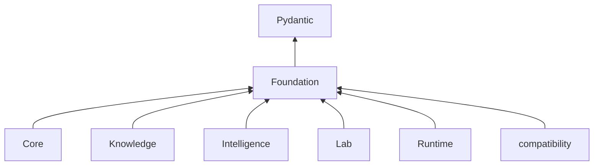

# Dependency governance

Foundation sits at the bottom of the product dependency graph. Its required
runtime library dependency is Pydantic; product packages depend on Foundation,
never the reverse.

## Admission test

| Question | Acceptable answer |
| --- | --- |
| which shared contract needs the dependency? | named identity, outcome, serialization, compatibility, provenance, support, or testing contract |
| can Python or the existing Pydantic boundary express it? | no, with a concrete missing capability |
| does the library carry product policy? | no scientific, evidence, decision, execution, or Lab policy |
| what enters the base installation? | explicit modules, version range, license, vulnerability and supply-chain posture |
| how does failure appear? | import and unsupported-state behavior are explicit and tested |
| can the dependency be isolated? | adapters keep library types outside public Foundation contracts where practical |
| what proves compatibility? | focused tests plus affected consumer tests |

Reject dependencies that require Core, Knowledge, Intelligence, Lab, Runtime,
the compatibility package, network services, credentials, or environment state
to interpret a Foundation value. Optional scientific libraries may support
tests; they do not become hidden runtime requirements.

## Change consequences

A dependency version can alter validation, JSON encoding, schema generation,
error text, typing, or import behavior without changing Foundation source.
Review canonical bytes, schema fixtures, public API, migration paths, and
consumer behavior on upgrades. Pin or constrain versions when the public
contract depends on behavior outside Foundation’s control.

Package aliases route approved imports; they are not permission to introduce a
second implementation or dependency stack.
